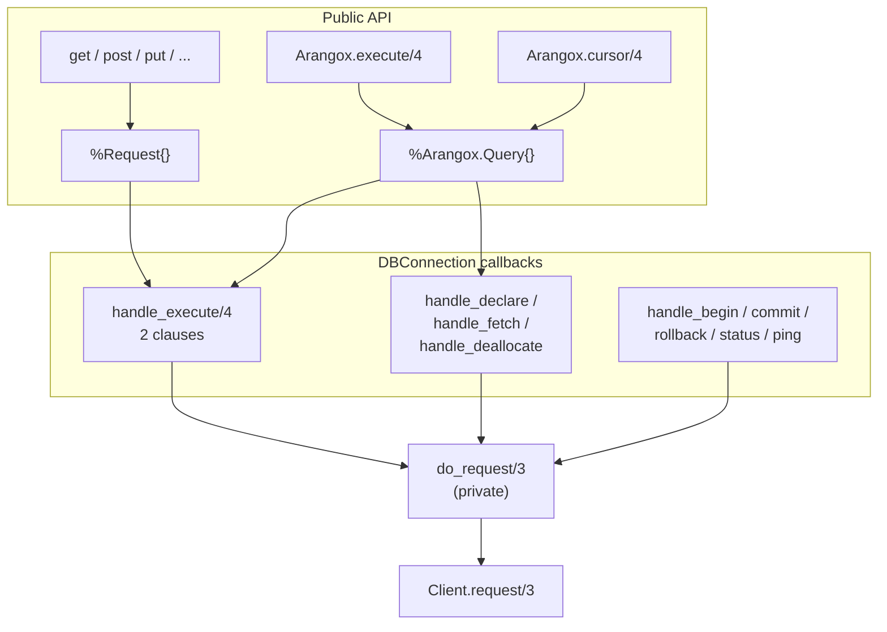
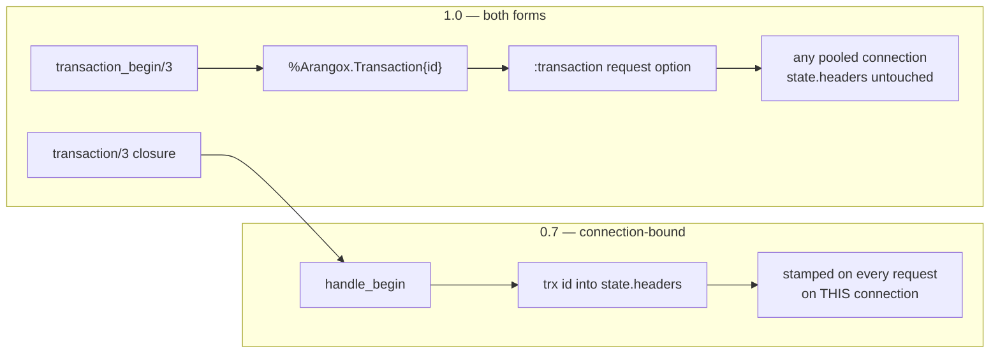
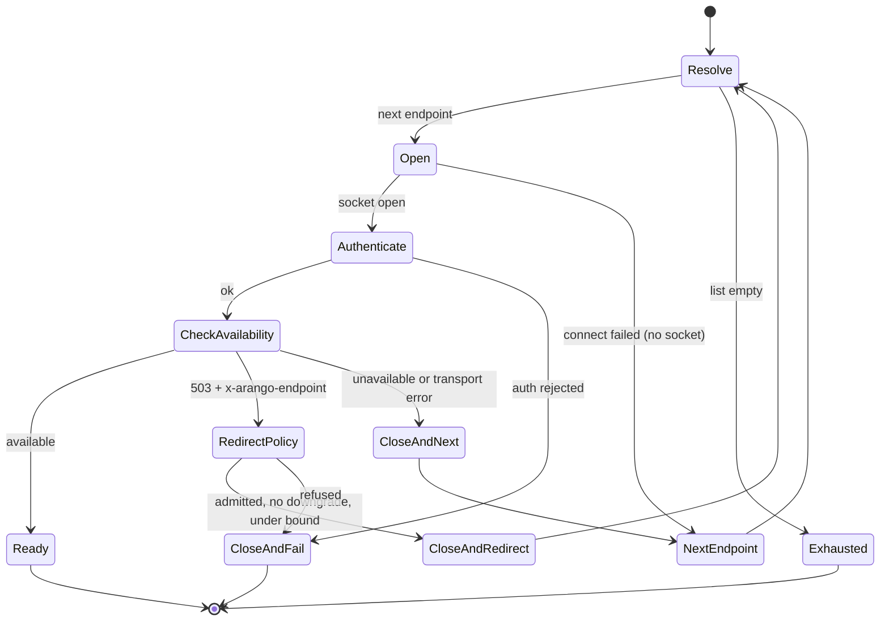

# Arangox 1.0 Modernization - Plan

## Goal Capsule

- **Objective:** Ship the arangox modernization — as 0.8.0, per KD13; "1.0" below names this release — a breaking release that makes HTTP (via Mint) the sole transport for ArangoDB 3.12+, adds AQL plan-cache support through DBConnection's prepare/execute lifecycle, adds a generated resource-object API covering ArangoDB's HTTP surface, adds opt-in VelocyPack request bodies, aligns naming with official-driver conventions, fixes the library's Elixir anti-patterns and known correctness bugs, closes the security gaps this plan's review surfaced, and splits the test suite into unit, protocol, and integration tiers. VelocyStream and active failover remain as explicitly supported 3.11-only options.
- **Authority hierarchy:** This document. Decisions marked `session-settled` were made by the author and are not open for re-litigation. On product behavior the R wins; on implementation mechanism the KTD wins within its cited R constraints; units override neither.
- **Stop conditions:** Stop and surface if the plan cache cannot be driven through prepare/execute without breaking the existing request path (KTD2), or if the redirect policy in R35 cannot admit the ordinary 3.11 active-failover topology.
- **Execution profile:** Behavior-preserving refactors dominate. Characterization coverage before rewriting `connect/1` and the transaction callbacks; test-first for new surface and for every security requirement.
- **Tail ownership:** Standard — branch, PR, CI to green. No deploy step; release to Hex is a separate manual act after merge.
- **Open blockers:** None. All Outstanding Questions are deferred to implementation.

**Product Contract preservation:** restructured, no scope change, plus additions. Splits: R2 → R2 (HTTP/2 negotiation) + R26 (cleartext); R4 → R4 (endpoint walk) + R27 (`read_only?` scoping); R12 → R12 (per-pool config) + R28 (public config readers). New: R29-R30 (VelocyPack, from KD10), R31-R34 (official-driver conventions and prepared-query streaming, from KD11 and KD4), R35-R38 (security and correctness, from this plan's review), R39-R43 (generated API surface, from KD12), R44 (transaction reachability, found during the transaction-callback rewrite), R45-R47 (cleartext policy, generated-parameter bounds, plan-cache version matrix — from the independent cross-model review). All `Governs`, `Covers`, and inline citations re-pointed.

---

## Product Contract

### Summary

A breaking modernization of arangox, shipping as 0.8.0 (KD13), with Mint as the default HTTP client, HTTP/2 negotiation on TLS endpoints, AQL plan-cache support via prepare/execute, a generated resource-object API over ArangoDB's published OpenAPI document, opt-in VelocyPack request bodies, official-driver naming conventions, all Elixir anti-patterns and known correctness bugs fixed, dependencies current, and a three-tier test suite. Nothing user-facing is deleted beyond Gun: VelocyStream, active failover, and the leader-redirect path stay as documented 3.11-only options.

### Problem Frame

Arangox 0.7.0 shipped in March 2024 and has not changed since. ArangoDB removed VelocyStream — the driver's default transport — in server 3.12, which closes VST connections on sight, so `Arangox.start_link/1` with default options cannot connect to any current server. ArangoDB removed active failover in the same release, orphaning the driver's leader/follower feature set. Meanwhile the server gained an AQL execution-plan cache (the closest thing ArangoDB has to prepared statements; a GitHub request for true prepared statements remains open) that the driver cannot use.

The codebase has drifted from current Elixir practice. A grounding audit found 15 `with` blocks producing 18 distinct anti-pattern findings — inverted `with` expressions, `else` clauses handling success shapes, non-exhaustive matches with `WithClauseError` exposure — plus `throw`/`exit` control flow inside callbacks contracted to return error tuples, library-global application config, and a client behaviour whose three implementations disagree on error types. Verified correctness bugs compound this: connection processes leak sockets on auth and availability failures, a transport error during availability checking halts endpoint failover early, MintClient defaults TLS to `verify_none`, and no client enforces any request timeout.

A security review of this plan surfaced a further class the audit did not reach: server-controlled values flow into paths, headers, decoders, and connect targets without validation. The leader-redirect path this release completes would, in its unguarded form, follow any host a responding server names and present the pool's credentials to it.

The library has real production users — ArangoDB itself uses it for cloud services — and the author will present it as a work sample for senior Elixir roles. Both audiences read the code; neither is served by quarantining legacy paths as untouchable.

### Key Decisions

- KD1. **One breaking 1.0 release, all workstreams together.** (session-settled: user-directed — chosen over shipping an unbreaking 0.7.1 default-flip first: one migration for users, one coherent pass over the code.) Governs R1-R47.
- KD2. **VelocyStream is kept as an opt-in client, off by default.** (session-settled: user-directed — chosen over removal: portfolio value when reviewers read the code, and server 3.11 is still supported.) Governs R3, R13, R20.
- KD3. **Active failover support is kept in full and redocumented.** (session-settled: user-directed — chosen over reframing as coordinator-only failover or dropping it: same 3.11 rationale as KD2.) Governs R4, R5, R21, R27.
- KD4. **Plan cache rides DBConnection's prepare/execute lifecycle.** (session-settled: user-directed — chosen over a plain query option: the idiomatic Elixir surface reviewers expect from Postgrex and MyXQL; the no-op close seam is documented rather than papered over.) Governs R6, R7, R8, R34.
- KD5. **~~Gun is removed; Mint is the only HTTP client.~~ Reversed 2026-08-11, user-directed: Gun stays, because it is in use.** Mint remains the default and the only client the documentation recommends; Gun is a supported optional client held to the same contract as the other two. The original reasoning is still sound about *symptoms* — the three-way error-term inconsistency and the `extra_applications` packaging bug were real — but both are fixable without deleting the client, and neither outweighs breaking working deployments. The packaging bug was never Gun's: it was `extras/1` forcing gun into `applications`, which U1 deleted separately and which must not return. Governs R2, R11, R18.
- KD6. **All known correctness bugs are fixed, including the TLS default flip to `verify_peer`.** (session-settled: user-directed — chosen over deferring the TLS flip: it breaks self-signed deployments, but shipping a 1.0 that silently skips certificate verification is indefensible.) Governs R14-R17, R44.
- KD7. **The leader-redirect path is finished, not deleted.** (session-settled: user-directed — chosen over removing the dead branch: completes the failover story kept by KD3. Conflict call-out: the plan's security review rated the unguarded form Critical — the feature ships only with the R35 policy that bounds where a redirect may point.) Governs R5, R35.
- KD8. **HTTP/2 negotiation ships now; multiplexing is deferred and publicly roadmapped.** (session-settled: user-approved — negotiation is nearly free via `Mint.HTTP`; multiplexing needs a different concurrency model than DBConnection's checkout-per-caller.) Governs R2, R23, R26.
- KD9. **Static analysis is Dialyzer via dialyxir, not Credo.** (session-settled: user-directed — chosen over keeping Credo or running both.) Governs R25.
- KD10. **VelocyPack request and response bodies ship opt-in, never as a default.** (session-settled: user-directed — chosen over JSON-only after the official-driver survey showed Go v2 deprecated and commented out VelocyPack, arangojs declined it, and Python never had it: the server still accepts the content type and the codec is already a dependency, so the capability ships behind an explicit option and a benchmark. Conflict call-out: the security review found two exploitable defects in the `velocy` decoder, which makes R36's boundary and the vendoring decision a condition of shipping this at all.) Governs R29, R30, R36.
- KD11. **API naming follows ArangoDB house style where a thin driver can adopt it.** (session-settled: user-approved — chosen over inventing Elixir-local names: all four official drivers name query options exactly as the HTTP API names them, and carry HTTP status and `errorNum` together in one structured error.) Governs R31, R32, R33.
- KD12. **The resource-object API is generated from ArangoDB's OpenAPI document and ships inside arangox, not as a separate package.** (session-settled: user-directed — chosen over deferring it to a follow-up `arangox_api` package: the three-layer split is the textbook decomposition but nobody would consume the driver without the API, so carrying the surface in one package is acceptable. Generated rather than hand-written because 243 operations cannot be hand-verified, and a server release must be a regeneration rather than a manual sweep.) Governs R39-R43.
- KD13. **This release ships as 0.8.0; 1.0 is reserved for the first release on `http_connection`.** (session-settled: user-directed, 2026-08-11 — chosen over shipping as 1.0 now.) Everywhere else in this document, "1.0" names this release and reads as 0.8.0; the document is not rewritten line by line. Deprecation promises renumber with it: what "1.0" deprecates, 0.9 removes. Reasoning: a version number manages a compatibility promise, and a 1.0's only content is "this surface is what we commit to." That promise cannot honestly cover this release, because DBConnection is committed to be replaced by `http_connection` (a planned foundational library for HTTP-based databases — ArangoDB, ClickHouse, MongoDB — replacing a pooling model built for SQL wire protocols) and DBConnection is visible in the public surface: `t:Arangox.conn/0` is `DBConnection.conn()`, pool-level failures surface as `DBConnection.ConnectionError`, cursors are `DBConnection.Stream`, and the pool options are DBConnection vocabulary. The swap is therefore breaking, and sequencing it 0.8 → swap → 1.0 puts the stability promise on the foundation that stays. Hex's `~>` operator treats the 0.x minor as the breaking boundary, so `~> 0.8` protects users exactly as `~> 1.0` would, and this release is breaking either way, so dependent churn is identical under both labels. The swap is committed, not speculative, which is what removes the "1.0-after-X becomes never" risk that kept postgrex at 0.x permanently.

### Requirements

**Transport**

- R1. The driver connects to ArangoDB 3.12+ out of the box: the default client is `Arangox.MintClient` and default options work against a stock 3.12 server.
- R2. The Mint client negotiates HTTP/2 by ALPN on TLS endpoints and falls back to HTTP/1.1, with no user-visible behavior difference between the two.
- R26. Cleartext endpoints use HTTP/1.1. Prior-knowledge h2c is available only through an explicit client option, and the documentation states this rather than implying negotiation happens everywhere.
- R3. VelocyStream remains available strictly as an explicit opt-in, is never selected by default, and its documentation states it works only with ArangoDB 3.11 and older.
- R29. Request and response bodies can be VelocyPack instead of JSON, selected per pool by an explicit option named for the content type. JSON remains the default.
- R30. The VelocyPack body path is benchmarked against JSON before release, and the documentation reports the measured result rather than asserting a benefit.

**Failover**

- R4. The ordered `:endpoints` walk and `:failover_callback` continue to work, and the documentation explains the walk's continued value on 3.12+ as failover across cluster coordinators.
- R27. `read_only?` is documented as applying to 3.11 active-failover deployments only, because its acceptance gate requires the server to report `readonly` mode, which no 3.12 coordinator does. 3.12 users wanting dirty reads are pointed at the header via `:headers`.
- R5. The leader-redirect path — following the server's `x-arango-endpoint` header on a 503 to the current leader — is completed and functional, including a way to remap server-advertised endpoints to reachable addresses when the server runs in a container.
- R35. A server-advertised redirect endpoint is followed only when it passes a redirect policy: its full normalized origin — encryption class, host, and port, where `tcp` is equivalent to `http` and `ssl`/`tls` to `https`, because the server advertises its own scheme vocabulary — must already appear in the configured `:endpoints`, or be admitted by an explicitly configured mapper whose output passes the same validation; the encryption class may not downgrade from encrypted to cleartext; the redirect count within one connect attempt is bounded; and a refused or unparseable redirect produces a structured error rather than raising, firing `:failover_callback` under the option's documented rule (the callback fires only when `:endpoints` is a list — a single binary endpoint reports through the returned error alone, and U5 kept redirects consistent with that rule rather than making them the one exception).
- R45. Authenticated cleartext to a non-loopback endpoint requires an explicit opt-in. Without it the pool refuses to start and names the option, because credentials sent over cleartext are readable in transit. Loopback endpoints are exempt, so the default configuration is unaffected.

**Plan cache**

- R6. Users run an AQL query and ask for the server's plan cache per query, with a `use_plan_cache` option. `DBConnection.prepare/3` is refused with an error naming that option rather than implemented: ArangoDB has no prepared statements, and its plan cache is a server-side memoisation of planning keyed by statement text, so a client-side prepared value has no part in the mechanism — measured, the cache key appears on the *second* execution of the same text and a different bind *value* hits the same entry. Preparing would therefore spend a pool checkout to set a boolean the caller can set directly. The cache is opt-in rather than defaulted because the server hard-errors on cache-ineligible statements such as UPSERTs (errorNum 1584, HTTP 500) and R47 gates it on server version; neither is fair to impose on a caller who did not ask for it. Executing a query returns the complete result set, draining server batches internally.
- R7. Responses surface the server's plan-cache key when the server returns one.
- R8. The driver exposes functions to list and clear the current database's plan cache, documented as database-wide administrative operations that expose and affect other callers' queries. They use the pool's existing credentials and surface an authorization failure as a structured error rather than an empty result. See Q8 — the permission levels stated here do not match the server's documented behavior, and the listing filters rather than refuses.
- R47. Plan-cache behavior is version-gated and stated as a matrix: core transport requires 3.12+ and plan caching requires 3.12.4+. The matrix previously also claimed cache-key delivery on batched cursors requires 3.12.5+; that is **withdrawn as unsupported** (measured 2026-08-10 on 3.12.4-3 and re-confirmed on 3.12.10: a `batchSize: 3` cursor over ten rows reported `planCacheKey` on its initial response *and* on the following batch, and the server's own schema qualifies the field only with "present if a cached query execution plan has been used", with no version condition). The floor itself remains unconfirmed above 3.12.4, but that no longer matters: the claim was that batching *withholds* the key below 3.12.5, and batching does not withhold it at 3.12.4. A correction to the record while here — the note that no 3.12.5 image was published was wrong. `arangodb:3.12.5` exists in the official repository; it is the `arangodb/arangodb` organisation repository that lacks it, and that is the repository docker-compose.yml used. The tier now runs the official images at 3.12.10 and both vendored artefacts are re-pinned to match. The driver learns the server version at connect and caches it in connection state, because a gate with no version source cannot be enforced. A query that asks for the plan cache against a server below the floor produces a structured error naming the required version rather than silently omitting the option. A query that did not ask is unaffected, which is what keeps the gate off callers who never opted in.
- R34. A prepared query may also be streamed through `Arangox.cursor/4`, and prepared queries never capture a database at prepare time, because plans are cached per database.

**API conventions**

- R31. AQL query options are accepted under the names the HTTP API uses, transliterated to snake_case atoms, with a documented mechanical mapping and a stated precedence against the existing `:properties` escape hatch.
- R32. `Arangox.Error` always carries HTTP status and ArangoDB `errorNum` together when the response body supplies them, plus an atom reason derived from `errorNum` for pattern matching. No driver-produced error, exception message, or struct inspection contains authentication material, with exactly one exception: a **connect-time** error restores the endpoint's credentials when the pool sets `:show_sensitive_data_on_connection_error`. Struct inspection and request-time errors are redacted unconditionally and have no opt-out. The exception exists because arangox already accepts that DBConnection option and developers reasonably expect it to work — and because DBConnection's own sanitizer (`connection.ex:80-85`) only covers exceptions *raised* out of `connect/1`, a path R10 and KTD7 deliberately removed, so a returned `{:error, exception}` is logged verbatim through `Exception.format_banner/3` with no redaction at all. Redaction is applied where the endpoint is *stored*, not only where it is rendered, so `inspect/1` cannot leak what the message hides. A body that cannot be decoded yields a structured error carrying the status and a bounded excerpt, never a raise. The server's message is documented as server-controlled and is length-bounded when rendered.
- R33. Stream transactions gain a handle-based form whose identity threads through per-request options, alongside the existing closure form. The handle form accepts only a transaction struct rather than a bare identifier, and is documented as a capability that must not cross a trust boundary. Its identifier is redacted from all **driver-authored** struct inspection, error rendering, and log output, the same as authentication material. The redaction cannot extend to the server's own words: ArangoDB echoes transaction identifiers inside `errorMessage` ("transaction 3298558924400 has already been committed" — measured, U7), and KTD11 requires the server's message verbatim, so a caller who logs `Exception.message/1` of a transaction error logs the identifier through the server's text. The `Arangox.Transaction` moduledoc documents this limit; scrubbing server messages would reopen KTD11 and is deliberately not done. The scope of its portability across pooled connections is set by Q6's answer and stated explicitly rather than promised unconditionally.

**Code quality**

- R9. Every finding in the anti-pattern audit is resolved or explicitly waived with a written reason. No `with` expression has an `else` that handles success shapes, is inverted, or can raise `WithClauseError`.
- R10. No callback contracted to return an error tuple uses `throw`, `exit`, or exceptions for control flow. No path within `connect/1` raises.
- R11. The `Arangox.Client` behaviour defines one error contract and both remaining implementations conform to it.
- R38. A client that detects a lost connection can still force a disconnect. The single error contract carries this signal explicitly, and the behaviour documents which reasons mean the socket is gone.
- R12. The JSON library and VelocyStream chunk size become per-pool start options rather than global application configuration.
- R28. `Arangox.json_library/0` and `Arangox.VelocyClient.vst_maxsize/0` are deprecated in 1.0, returning the configured fallback, and are listed for removal in 1.1.
- R13. The VelocyStream client is held to the same anti-pattern and quality standard as the rest of the library.

**Correctness and input safety**

- R14. `connect/1` closes any opened socket before returning an error or moving to the next endpoint, so a connection process that fails auth or availability checks leaks nothing.
- R15. A transport error while checking one endpoint's availability does not abort the walk; remaining endpoints are still tried.
- R16. TLS certificate verification defaults to `verify_peer` on both clients, with a documented trust source and hostname verification on, and refuses TLS below 1.2. When no certificate authority material can be resolved, the driver returns a structured error naming the remedies rather than raising. Opting out requires an explicit `verify: :verify_none`.
- R17. Every request carries a finite timeout, and no client waits on a socket indefinitely by default. The timeout budget is an absolute deadline established when the caller enters the pool, not a duration restarted at the socket — time spent waiting for a connection is spent budget, so a caller that waited out most of its allowance gets the remainder, never a fresh allocation. `:request_timeout` is validated as a positive finite value at both pool start and per request, and the derived socket timeout has a documented margin and a documented minimum, so no derivation can yield an infinite or non-positive wait. A timed-out request disconnects its connection rather than returning it to the pool, because the driver cannot establish where the response stream ended. A request that was fully written is never retried automatically.
- R44. A failed transaction commit leaves the transaction reachable, so a subsequent rollback addresses the real server-side transaction rather than reporting that none is in flight.
- R36. Body decoding never raises and never runs unbounded: both codecs sit behind a boundary that converts failure into a structured error, and the boundary's promises are pinned by malformed-body fixtures in the unit tier. The generative fuzz corpus for the decoder itself lives upstream in `velocy` (maintainer-owned, see U12 step 4), where it runs against every decoder change rather than against whichever version this repository pins. Bounds are enforced **before** decoding — on raw body size and on length-prefix continuation bytes — because the known quadratic length-parsing defect consumes CPU before a decoded size can be known. The raw-size limit has a documented default and a per-pool override.
- R37. Values the driver interpolates into a request path — `:database` and server-supplied cursor identifiers — are validated and encoded before interpolation. Validation runs at option validation and again at one shared request seam that every path reaches: hand-written requests, prepared queries, cursors, and generated operations. An invalid value is rejected rather than reaching a socket.
- R46. Caller-controlled values in generated operations are bounded: a path-parameter value that could alter path structure (`/`, `?`, `#`, `%`, control characters) is refused, every other value is percent-encoded per segment, query and header values reject carriage return, line feed, and null, and no generated operation may override the scheme, host, or authorization the pool established. Refusal rather than post-hoc encoding for structure-altering values is forced by the generator's output shape: the generated url interpolates the raw value before the adapter runs, so the value's position cannot be recovered soundly — any relocation scheme is defeatable by values that collide with static path text. It is also R37's existing rule for `:database`.

**Packaging and dependencies**

- R18. All runtime and development dependencies are current at release time; the compiled app file lists every optional dependency as optional, Gun included, and no dependency is forced into `applications` by an `extra_applications` override.
- R19. Declared Elixir and OTP requirements match what the code needs, and CI runs a matrix covering at least the declared minimum and the current release of both, with CI actions themselves current.

**Testing and CI**

- R20. The suite has three tiers: unit (no network, `async: true`), protocol (real clients against a local controlled server), and integration (real ArangoDB, tagged, excluded by default). `mix test` on a fresh clone passes with no Docker running.
- R21. CI runs unit and protocol tiers in a containerless job, and the integration tier as separate matrix jobs against 3.12+ and 3.11.
- R22. The compose setup works on a fresh checkout with no untracked files, each tier starts only the containers it needs, every service defines a healthcheck, and published ports bind to loopback rather than all interfaces.
- R25. CI enforces `mix format --check-formatted` and Dialyzer via dialyxir with a cached PLT. Credo is not used and its configuration is removed.

**Generated API surface**

- R39. The library exposes typed functions covering every operation in ArangoDB's documented HTTP API, generated from the vendor's published OpenAPI document rather than hand-written. Complete coverage is release-blocking; an operation the generator cannot produce is resolved by committed preprocessing, not dropped. An operation may be excluded only by an explicit waiver recorded in this plan with its reason, and the waived set is enumerated in the documentation so users know the boundary before they reach it.
- R40. The OpenAPI document is vendored at a pinned server version, and the generator configuration lives in the repository, so regeneration is reproducible by anyone who clones it.
- R41. Generated code reaches the network through one narrow adapter that calls the driver's existing request function. No generated module talks to a socket, a client, or connection state directly, so a later transport change touches the adapter rather than every operation.
- R42. Regenerating against the pinned document produces no diff, and CI proves it. Regenerating against a newer server document is a reviewable diff, not a manual sweep.
- R43. Generated functions carry the driver's error contract: a failed operation returns the same structured error as a hand-written request, with HTTP status, ArangoDB error number, and atom reason.

**Documentation**

- R23. The CHANGELOG documents every breaking change with a migration path, including the client behaviour signature change, the TLS change with both escapes, the redirect policy, and the disconnect-on-timeout behavior. It states that HTTP/2 stream multiplexing is not yet exploited and a solution is planned.
- R24. README and moduledocs describe the 1.0 reality: Mint default, Gun and VelocyStream as supported optional clients, failover as a 3.11 option, plan-cache usage, current install snippets, and accurate defaults.

### Key Flows

- F1. **Default connect against a current server**
  - **Trigger:** `Arangox.start_link/1` with only defaults.
  - **Steps:** Mint connects to `http://localhost:8529` over HTTP/1.1; on a TLS endpoint it negotiates HTTP/2 by ALPN; authenticates if configured; the pool becomes ready.
  - **Outcome:** Requests succeed against ArangoDB 3.12+. **Covers R1, R2, R26.**
- F2. **Prepared query with plan cache**
  - **Trigger:** User prepares an AQL query, then executes it repeatedly with different bind values.
  - **Steps:** Prepare wraps the query with plan-cache intent without binding a database; each execute sends it with the cache option and drains all server batches; responses carry the cache key once a plan is cached.
  - **Outcome:** Repeated executions skip server-side planning. **Covers R6, R7, R34.**
- F3. **Endpoint failover with leader redirect**
  - **Trigger:** Pool starts with an ordered endpoint list against a 3.11 active-failover deployment; the first endpoint is a follower.
  - **Steps:** Connect succeeds, the availability check reports unavailable, the socket closes, the walk proceeds; a 503 carrying `x-arango-endpoint` is admitted by the redirect policy and followed; the callback fires per failure.
  - **Outcome:** The pool lands on the leader without leaking sockets and without following an unadmitted host. **Covers R4, R5, R35, R14, R15.**
- F4. **Migrating a 0.7 application**
  - **Trigger:** An existing application upgrades and still passes `client: Arangox.GunClient` or sets application config.
  - **Steps:** The pool starts on Gun as before; application config still works but logs a deprecation warning. Where `:gun` is not in the dependency list, start-up refuses with an error naming the missing dependency.
  - **Outcome:** A working 0.7 deployment keeps working, and the one failure mode left is self-explanatory rather than a missing-module error. **Covers R18, R12, R23.**

### Acceptance Examples

- AE1. **Covers R1.** Given a stock ArangoDB 3.12 container and `{:ok, conn} = Arangox.start_link()`, `Arangox.get!(conn, "/_api/version")` returns a 200 response.
- AE2. **Covers R3.** Given no `:client` option, VelocyStream code is never invoked; given `client: Arangox.VelocyClient` against a 3.12 server, the connection fails with an error naming VST removal rather than hanging or reporting a bare `:closed`. *(U10 measured the signature: 3.12 closes on the first VelocyStream message, not after the handshake. See the U10 test scenario for the detail and its consequence for where the check can live.)*
- AE3. **Covers R14.** Given an endpoint that accepts TCP but fails the availability check, when a pool of N processes starts and retries over a period, open ports owned by the pool do not grow beyond N.
- AE4. **Covers R16.** Given an HTTPS endpoint with a self-signed certificate and default options, the connection is refused with a certificate error; adding `ssl_opts: [verify: :verify_none]` restores the old behavior.
- AE5. **Covers R17.** Given a server that accepts a request and never responds, the caller receives an error within the request timeout, the connection is torn down, and a subsequent request is served by a fresh connection.
- AE6. **Covers R20.** Given a fresh clone with no Docker daemon running, `mix test` passes, and `mix test.integration` fails fast with a message naming the container setup it needs.
- AE7. **Covers R8.** Given a value `DBConnection` closes because describe or encode raised, close answers rather than raising a second error over the first; given a query struct, it succeeds as a no-op explaining there is nothing to release server-side.
- AE8. **Covers R6.** Given a prepared query whose result exceeds one server batch, executing it returns every row rather than the first batch, and leaves no cursor open on the server.
- AE9. **Covers R6, R32.** Given a query that asked for the plan cache and that the server refuses to cache (an UPSERT, or an attribute-name bind parameter), executing it returns an error carrying the server's `errorNum` and an atom reason, not a masked success. Measured: errorNum 1584, `:query_not_eligible_for_plan_caching`, HTTP 500.
- AE10. **Covers R33.** Given a transaction handle obtained from the handle-based form, passing it to a request on a different pooled connection reaching the same coordinator applies the transaction, because identity travels in the request rather than the connection. Whether the guarantee extends across coordinators is set by Q6's answer, resolved in U7 before the form is built; this example is written to the verified scope, not the hoped-for one.
- AE11. **Covers R18.** ~~Given an application that still sets `client: Arangox.GunClient`, start-up raises an error naming `Arangox.MintClient` as the replacement.~~ **Withdrawn 2026-08-11 with KD5's reversal.** An application that sets `client: Arangox.GunClient` starts and works. What replaces it: with `:gun` absent from the dependency list, start-up refuses with an error naming the missing dependency, the same way `Arangox.VelocyClient` does without `:velocy`.
- AE12. **Covers R35.** Given a server that responds 503 with `x-arango-endpoint` naming a host absent from the configured endpoints and no mapper configured, the connection fails with a structured error and no request carrying an authorization header is sent to that host.
- AE13. **Covers R32.** Given a pool configured with credentials in the endpoint's userinfo, a failed connect produces logs containing neither the password nor its base64 encoding, and inspecting the connection state reveals neither.
- AE14. **Covers R37.** Given `database: "app/_admin/log"`, the option is rejected at validation; given a legal name containing characters requiring encoding, the request path carries the encoded form.

### Scope Boundaries

- **Deferred for later**
  - HTTP/2 stream multiplexing — the concurrency-model change that would recover VelocyStream's multiplexing value. Publicly noted per R23.
- **Deferred to Follow-Up Work**
  - Cluster coordinator auto-discovery, in-driver JWT acquisition and refresh, a named endpoint load-balancing strategy, retry-on-write-conflict, and request/response compression — official-driver conventions a thin driver could adopt, none required to unbreak the driver.
  - Hand-written ergonomics over the generated surface (fluent builders, struct mapping, per-operation typed exceptions). The generated layer is a faithful projection of the HTTP API; opinionated sugar on top is a later decision informed by how the generated surface actually reads.
- **Outside this product's identity**
  - Supporting ArangoDB versions older than 3.11.
  - Hand-maintaining the resource surface. If generation proves unworkable against the published document (Q7), the fallback is to fix or preprocess the document, not to hand-write 243 operations.
  - Query builders, schema helpers, and an Ecto adapter. The generated surface is a faithful projection of ArangoDB's HTTP API; an abstraction layer that reinterprets it is a different product.

### Dependencies / Assumptions

- ArangoDB 3.11 and 3.12 are both supported server lines as of August 2026, and 3.11 images remain pullable for CI.
- The `velocy` package is unmaintained since 2024 and its decoder has two confirmed defects: an unrescued `ArgumentError` from out-of-range date parsing, and quadratic length parsing with no bound. U12 owns the vendor-or-fork decision; R36's boundary is required either way.
- Certificate authority material is resolvable from the operating system store on supported OTP versions, with `castore` as a fallback. Whether `castore` becomes a hard dependency is decided in U10.
- Mint ≥ 1.9 provides unix-domain-socket support and HTTP/2, verified empirically against 1.9.3.
- The plan cache requires ArangoDB 3.12.4+, and delivery of the cache key on batched cursors requires 3.12.5+.
- db_connection resolves within `~> 2.6`; the callback contracts this plan codes against were read from the vendored 2.6.0 source. The resolved version is pinned and re-verified in U1.
- ArangoDB publishes a machine-readable OpenAPI 3.1 document in the server repository at `js/apps/system/_admin/aardvark/APP/api-docs.json` — 1.24 MB, 160 paths, 238 operations at tag 3.12.5. It is the only realistic source for R39.
- `oapi_generator` (v0.4.0, December 2025) is the only maintained Elixir OpenAPI client generator. Its generated operations end in a call to a configurable client module, which is what makes R41's narrow adapter possible. **Its OpenAPI 3.1 support is unconfirmed** — its documentation references a 3.0 example and states no version support — and ArangoDB has a history of malformed fields in its published document. Both are resolved by U19's spike before any generated code lands.

### Outstanding Questions

- **Deferred to Implementation**
  - Q2. Whether `handle_status` keeps its server round-trip or becomes local state, once the transaction callbacks are rewritten (U6).
  - Q4. Whether the VelocyPack body path is fast enough to document as recommended for any workload, decided by the R30 benchmark (U12).
  - Q8. What permissions the plan-cache endpoints actually require, and whether an unpermitted caller is refused or merely filtered (U8, R8). R8 states "database-administration permission" and expects "a structured error rather than an empty result". The server's own OpenAPI document (`priv/openapi/api-docs-3.12.5.json`) says otherwise: `GET /_api/query-plan-cache` requires **read** privileges on the database and returns "only those query plans for which the current user has at least read permissions on all collections and Views included in the query"; `DELETE` requires **write** privileges. So a partially-permitted caller gets a *shorter list*, and one permitted on no collections gets `[]`, which is indistinguishable from an empty cache. **RESOLVED (measured 2026-08-10, ArangoDB 3.12.4-3, the `single_auth` service on host port 8001, against a purpose-made restricted user):** the document is accurate, and the levels are per *database*, not administrative. With **no grant** on the database, both endpoints answer **401** `errorNum 11` "not authorized to execute this request". With **read** on the database but no access to a cached query's collection, `GET` answers **200 with `[]`** — filtered, not refused — while `DELETE` answers **403** `errorNum 11` "not allowed to clear this database's query plan cache entries". Granting read on the collection makes the entry appear; granting write on the database makes `DELETE` answer 200.

    So R8 splits three ways. A refusal *is* a structured error, at both 401 and 403, which satisfies R8 for the denial cases. A **filtered** listing is not distinguishable from an empty cache and no driver behavior can make it so — R8's "rather than an empty result" is unreachable there and must be documented rather than implemented. And note the 401: it is in the default `:disconnect_on_error_codes`, so an unauthorized listing retires the pooled connection. ArangoDB uses 401 with the same `errorNum 11` for "bad credentials" and "valid credentials, insufficient rights", so the driver cannot tell them apart to treat them differently; U8 documents the consequence rather than special-casing it.
  - Q5. Whether a 3.11 server rejects or ignores an unknown `usePlanCache` option (U8). R47's version gate already decides the user-visible behavior — a query that asked for the cache errors below the floor regardless — so this probe is defense-in-depth: it verifies what happens if the gate is ever bypassed or the version was misdetected, not what the driver promises. **RESOLVED (measured 2026-08-10, ArangoDB 3.11.8 and re-confirmed on 3.11.14 — the `resilient_single` service in docker-compose.yml, reached through its leader with an `:endpoint_mapper`):** 3.11 **silently ignores** it. `POST /_api/cursor` with `options: {usePlanCache: true}` answers `201` with the full result and no `planCacheKey`, identically to a deliberately invented option name and to no options at all. 3.11 also has no `/_api/query-plan-cache` path — it answers "unknown path". So a bypassed or misdetected gate degrades silently rather than loudly: the caller asks for plan caching, does not get it, and is not told. That is precisely the outcome R47's gate exists to prevent, and it means the gate cannot be relaxed into trusting the server to complain.
  - Q6. Whether ArangoDB routes stream-transaction identity across cluster coordinators, which determines whether AE10's cross-connection guarantee holds on a cluster or only on a single server. **Resolved first in U7, before the handle form is built** — R33's scope is written from the answer rather than assumed, so the contract is backed by a verified fact. **RESOLVED (measured 2026-08-08, ArangoDB 3.12.4-3, local 3-coordinator cluster — the `cluster` service in docker-compose.yml, coordinators on host ports 8006/8007/8008):** identity routes across coordinators in full. A transaction begun on coordinator A accepted a write through B, served an isolated read through C (visible under the transaction, 404 without it), reported `running` through B, and committed through C, after which the write was durable everywhere; the abort variant rolled the write back the same way. Coordinator identities confirmed distinct via `/_admin/status` serverId. So AE10's cross-connection guarantee holds on a cluster and R33 may promise it. Mechanism note for U7's validation: transaction identifiers encode the issuing coordinator and foreign coordinators forward to it — a fabricated identifier fails with `400`/`errorNum 10` "invalid transaction ID" on every coordinator, not `404`, and `GET /_api/transaction/{id}` on a committed or aborted transaction keeps answering `200` with `result.status` `"committed"`/`"aborted"` for a retention window rather than disappearing immediately. Error-shape assertions in U7's tests must expect both behaviors.
  - Q7. Whether `oapi_generator` consumes ArangoDB's OpenAPI 3.1 document as published, needs it down-converted to 3.0, or needs specific malformed constructs preprocessed. U19's spike answers this before any generated code lands; the answer determines whether U20 and U21 proceed as written or gain a preprocessing step.

### Sources / Research

- Anti-pattern audit: 18 findings across 15 `with` blocks; `lib/arangox/connection.ex` holds 7 of the 13 `with/else` blocks, `lib/arangox/client/velocy.ex` 3.
- Verified claims: leak paths `lib/arangox/connection.ex:99,196-208,226`; DBConnection retries in the same process under default `:rand_exp` backoff, `deps/db_connection/lib/db_connection/connection.ex:124-140`, `backoff.ex:9`; compile-env no-op `lib/arangox/client/velocy.ex:27,32` versus `test/arangox/client_test.exs:80,94`; TLS default `lib/arangox/client/mint.ex:33-36`; gun packaging `mix.exs:30,33-34`; missing `@external_resource` `lib/arangox.ex:2`.
- DBConnection mechanics: all `handle_*` callbacks run in the caller process — the pool gives the ETS holder away to the caller pid (`holder.ex:211-212`), which reads the module and state out of the table and applies them itself (`holder.ex:144-167`, ending in the `holder_apply/4` call at `:165-166`; the bare `apply/3` is at `:377-379`). *(Corrected during U3/compound verification: this note previously cited `holder.ex:121-155` and `:352-364`, which are `checkin/1` and error-message construction respectively; see `docs/solutions/architecture-patterns/dbconnection-timeout-is-a-deadline-not-a-duration.md` for the verified trace.)* `handle_prepare/3` is 3-arity. Order is parse, `handle_prepare`, describe, encode, `handle_execute`, decode. DBConnection caches no prepared queries. `Query.decode/3` runs on every cursor batch (`db_connection.ex:1925-1932`). `run_execute` takes position 2 of the returned tuple as the query (`db_connection.ex:1512-1514`). The execute deadline timer is armed against the pool process (`holder.ex:316-318`, `start_deadline/5` at `:452-457`) and its expiry disconnects via `connection_pool.ex:188-208` without unblocking a caller stuck in `recv`.
- Plan cache: `usePlanCache` nests inside the cursor body's `options`; `planCacheKey` returns at the response top level only on a cache hit; `GET`/`DELETE /_api/query-plan-cache` manage it. Ineligible queries error rather than silently bypassing. Minimum 3.12.4; batched-cursor key delivery fixed in 3.12.5.
- Official-driver survey (Go v2, Java v7, arangojs, python-arango): query options are named exactly as the HTTP API names them in all four; the `{error, code, errorNum, errorMessage}` quadruple is canonical; stream-transaction identity threads through per-request options; Java defaults to HTTP/2 with one multiplexed connection per host. Go v2 has `application/x-velocypack` commented out and deprecated; arangojs closed the VelocyPack request as not planned.
- Mint TLS: when neither `:cacertfile` nor `:cacerts` is supplied, `add_cacerts/1` first tries the OS trust store via `:public_key.cacerts_get/0` and only falls back to `raise_on_missing_castore!` when that raises (`deps/mint/lib/mint/core/transport/ssl.ex:570-582`, `:706-718` in mint 1.9.3). On any machine where the OS store resolves — every supported OTP here — the "CA trust store" raise is unreachable: verification genuinely runs and a self-signed server fails the handshake with a normalized `:tls_alert` error, which is what the suite now asserts (`test/arangox/client_test.exs`, the `ssl and ssl_opts` / `client_opts` tests). *(Corrected during the first full integration run: the note previously described the raise as the observable and cited assertions that no longer exist. R16's "structured error naming the remedies" case — no CA material resolvable at all — remains real but needs `cacerts_get/0` to fail to be reachable; U10 must simulate that rather than assume it.)* *(Amended in U10: the unit tier cannot simulate it. `cacerts_get/0` reads the platform trust store directly — the macOS keychain, the well-known bundle paths on Linux — and honours no environment variable that would redirect or empty it; measured on OTP 28, `SSL_CERT_FILE=/nonexistent` still returns 161 certificates. Nothing in the driver's own process can make it fail, so the scenario moved to the integration tier, where a container without a CA bundle is the only faithful way to ask. What the driver does own on this path is the contract that it answers with an error instead of raising, which is testable here and now covered separately.)*
- `velocy` decoder defects: `parse/2` rescues only `MatchError` and `CaseClauseError` (`deps/velocy/lib/velocy_pack/decoder.ex:20-29`) while `parse_date_time/1` can raise `ArgumentError` (`:129-130`); `parse_length/4` is quadratic with no bound (`:312-332`).

---

## Planning Contract

### Key Technical Decisions

- KTD1. **`Mint.HTTP` replaces the pinned `Mint.HTTP1`.** The client aliases `Mint.HTTP1` today, which forecloses HTTP/2 entirely. `Mint.HTTP` dispatches to either and returns the same response-stream shape, so the response assembler needs a version-agnostic rewrite with a fallback clause it currently lacks. Implements R2, R26.
- KTD2. **Extract a private request function; `handle_execute/4` becomes two honest clauses.** The query slot currently holds four shapes, and only five of the eight internal call sites pass `nil` — `handle_declare`, `handle_fetch`, and `handle_deallocate` pass the *query*, which under R34 can be an `%Arangox.Query{}`. A clause dispatching on the query argument would therefore intercept all three cursor callbacks and send a cursor body in place of their intended request, breaking R34 in the path its own tests would not exercise. Extracting the send-and-interpret body into a private function that all internal sites call directly removes the hazard by construction and deletes the `nil` argument rather than preserving it. Implements R6, R34. (session-settled: user-directed — inherits KD4.)
- KTD3. **Prepared execution drains batches inside the request path.** A cursor response carrying `hasMore: true` would otherwise leak a server-side cursor and silently truncate results. Draining keeps execute a complete-result function; callers wanting laziness use `Arangox.cursor/4`. Implements R6, R34; realizes AE8.
- KTD4. **`Arangox.Query` captures neither a database nor a plan-cache key.** Plans are cached per database and `:database` resolves per request, so capturing either would silently break cross-database reuse. Implements R34.
- KTD5. **The client behaviour's `request` callback takes an options argument, and the timeout is an absolute deadline carried through checkout.** A per-request timeout has no path to the socket today. The socket wait must end before DBConnection's checkout deadline, because that deadline fires on the pool process and tears the connection down without unblocking a caller blocked in `recv`. Comparing durations is not sufficient: the caller's deadline starts ticking when it requests a connection, so a caller that spent most of its allowance queueing would otherwise enter the socket with a full fresh budget and outlive the very deadline this decision exists to beat. Establish a monotonic deadline at entry, carry it through, and derive the socket timeout from the *remaining* budget. The option is named `:request_timeout` to avoid colliding with DBConnection's own `:timeout` key in the same keyword list. *(Amended during U9: the deadline needs no new key to travel in. `:deadline` is DBConnection's own public option — declared in its `t:option/0` type, listed among the options it forwards, and documented on every execute-family function as "absolute monotonic time in milliseconds by which caller expects request to complete" — which is exactly this quantity. `abs_timeout/2` consumes it as `min(now + timeout, opts[:deadline])`, so stamping it both avoids a competing key and pulls DBConnection's own checkout deadline onto the same instant rather than one fractionally later.)* Implements R17, R11, R23.
- KTD6. **One error contract, with an explicit disconnect signal.** Clients currently return raw POSIX atoms, exception structs, or bare binaries, and the connection layer compensates downstream. Normalizing to `{:error, %Arangox.Error{}, state}` removes the compensation — but it also erases the `:noproc` sentinel that today forces a disconnect. The struct therefore carries a reason class meaning "socket gone", which the request path maps to `{:disconnect, …}`. Without that, a lost socket would return to the pool intact and poison every later checkout. Implements R11, R32, R38.
- KTD7. **`connect/1` becomes a linear pipeline with explicit socket ownership and no raising path.** Each stage owns the socket and closes it on every exit that is not a successful return. Endpoint parsing and client connect must return errors rather than raise, because a raise from `connect/1` escapes the `gen_statem` callback and produces a supervisor crash loop with no backoff. Implements R14, R15, R10, R9; realizes AE3.
- KTD8. **Redirect targets are admitted by policy, not by default.** The advertised endpoint is followed only when its host already appears in the configured `:endpoints`, or when an explicitly configured `:endpoint_mapper` admits it; encrypted origins may not redirect to cleartext; the chain is bounded per connect attempt. The mapper is a documented trust boundary — a mapper returning its input unchanged reopens the credential-disclosure path the security review rated Critical. Implements R5, R35.
- KTD9. **Application config becomes per-pool options with a deprecating fallback.** `:json_library` and `:vst_maxsize` move to start options; the application-config read stays for 1.0 behind a deprecation warning emitted once per pool, and is listed for removal in 1.1. The two public reader functions are deprecated with it. Implements R12, R28.
- KTD10. **Transaction handles thread identity through request options; the closure form stays.** Both official drivers pass the transaction identifier per operation rather than binding a connection. The handle form must never write to connection headers, or a checked-in connection would carry the previous caller's transaction to whoever picks it up next. The option accepts only a transaction struct, because the identifier is a bearer capability and server-assigned identifiers are sequential. Implements R33.
- KTD11. **Error reasons are atoms derived from a vendored `errorNum` table.** Go generates named constants from the table ArangoDB publishes; Elixir's idiom is pattern matching, so a `:reason` atom beats exported integer constants. The atom is the documented surface for application branching; the server's message stays verbatim but is documented as server-controlled and bounded when rendered. `:reason` does not join the error's message prefix, so existing message strings are unchanged. Implements R32.
- KTD12. **VelocyPack selection is a single pool option; the codec is resolved once at connect and invoked behind a failure boundary.** Content type drives both the request content type and the accept header. The existing encode/decode seam is a single choke point, so this is a codec swap — but it must preserve the `application/x-arango-dump` line-delimited clause, which is JSON-specific, and it must not raise on undecodable input. Implements R29, R36.
- KTD13. **The protocol tier uses `plug_cowboy` directly, not Bypass.** Bypass last released in 2020; the tier needs a server that can hang, truncate, and send malformed frames, plus TLS with a known certificate. A Plug harness cannot speak VelocyStream, so VST coverage that needs a protocol-speaking peer runs against the 3.11 container. *(Narrowed during U9: a VST case that only needs the server to stay **silent** needs no peer that speaks the protocol at all. `VelocyClient.connect/2` writes its handshake and never reads a reply, so a bare `:gen_tcp` listener that accepts and says nothing exercises the receive bound in the protocol tier, in milliseconds and with no Docker. Send the 3.11 container only the cases where the exchange must actually complete.)* Implements R20.
- KTD15. **The generated surface is produced by `oapi_generator` and calls one adapter module.** The generator emits operations ending in a call to a configurable client module, so a single adapter translating that call into the driver's request function is the entire integration seam. Generated modules live under their own namespace and are committed to the repository — generation is a development-time step, not a compile-time or runtime one. Implements R39, R41. (session-settled: user-directed — inherits KD12.)
- KTD16. **The OpenAPI document is vendored and pinned, and CI proves the committed output matches it.** A drifting remote document would make regeneration non-reproducible and turn every server release into a silent diff. Vendoring the document at an explicit server version, committing the generator configuration beside it, and failing CI when regeneration produces a diff makes the generated surface auditable: the committed code is provably what the pinned document plus the committed configuration produce. Implements R40, R42.
- KTD14. **The global `DBConnection.Query` implementation for `BitString` is removed.** A library shipping a protocol implementation for a built-in type makes any host application that also installs another driver doing the same un-consolidatable. R34 already converges binary and prepared queries on one struct, so `cursor/4` wraps a binary at the API boundary and the global implementation is unnecessary. 1.0 is the only release where removing it is not a further break. Implements R34.

### High-Level Technical Design

The query slot is the structural problem this release solves. Extracting the request path is what makes the new shape safe:

Transaction identity moves out of connection state, which is what decouples it from checkout:

Connect is linear, with the socket owned by one stage and the redirect gated by policy:

### Assumptions

- The ordinary 3.11 active-failover topology lists its members in `:endpoints`, so R35's default policy admits the legitimate redirect without configuration. U5 verifies this against the failover container before the policy is considered settled.

### Sequencing

- **Phase A — foundation:** U1, U15, U17, U13, U19, U3, U4, U5
- **Phase B — features and quality:** U2, U6, U7, U9, U8, U10, U11, U22, U12, U20, U21, U16
- **Phase C — release:** U18, U14

U19 sits in Phase A because its spike answers Q7, and a negative answer changes what U20 and U21 are. The generated surface (U20, U21) lands late in Phase B: it depends on the request function U8 extracts and the error contract U2 establishes, and generating against a moving target would mean regenerating repeatedly.

Two ordering constraints drive this. The protocol harness (U17) precedes every unit whose tests need a controllable server — U3, U5, U9, U10 all depend on it. And the assertive-matching sweep over the connection module (U16) runs last, because nine units rewrite that file.

Within `lib/arangox/connection.ex` the order is: U3 (pipeline), U4 (option resolution into the pipeline), U5 (redirect into the pipeline), U2 (client call sites), U6 (transaction helper), U7 (handles), U9 (options to the client call), U8 (query clause and cursor callbacks), U12 (codec seam), U16 (assertive pass).

---

## Implementation Units

| U-ID | Title | Key files | Depends on |
|---|---|---|---|
| U1 | Dependency refresh, Gun removal, packaging | `mix.exs`, `lib/arangox/client/gun.ex` | — |
| U22 | Gun client restored to the 1.0 contract (reverses U1's deletion) | `mix.exs`, `lib/arangox/client/gun.ex`, `lib/arangox.ex`, `test/arangox/client_contract_test.exs` | U2, U9, U17 |
| U15 | Public-surface validation and docs hygiene | `lib/arangox.ex`, `lib/arangox/error.ex` | U1 |
| U17 | Protocol-tier test harness | `test/support/`, `mix.exs` | U1 |
| U13 | Three-tier test organization | `test/test_helper.exs`, `test/**` | U1 |
| U3 | Rewrite `connect/1` | `lib/arangox/connection.ex` | U17, U13 |
| U4 | Per-pool configuration | `lib/arangox/connection.ex`, `lib/arangox.ex` | U1, U3 |
| U5 | Leader redirect with policy | `lib/arangox/connection.ex` | U3, U17 |
| U2 | Client error contract, options, redaction | `lib/arangox/client.ex`, both clients | U1, U3 |
| U6 | Rewrite transaction callbacks | `lib/arangox/connection.ex`, `lib/arangox/transaction.ex` | U3 |
| U7 | Transaction handles | `lib/arangox.ex`, `lib/arangox/transaction.ex` | U6 |
| U9 | Request timeouts | both clients, `lib/arangox/connection.ex` | U2, U17 |
| U8 | Prepared queries and plan cache | `lib/arangox/query.ex`, `lib/arangox/connection.ex` | U2, U4, U9 |
| U10 | TLS trust and Mint HTTP/2 | `lib/arangox/client/mint.ex`, `lib/arangox/client/velocy.ex` | U2, U17 |
| U11 | VelocyStream client quality | `lib/arangox/client/velocy.ex` | U2, U4 |
| U12 | VelocyPack bodies and decode boundary | `lib/arangox/connection.ex`, `bench/` | U4, U8 |
| U16 | Connection-module assertive pass | `lib/arangox/connection.ex`, `lib/arangox/request.ex`, `lib/arangox/transaction.ex` | U2, U3, U5, U6, U7, U8, U9, U12 |
| U19 | OpenAPI spike and spec vendoring | `priv/openapi/`, `config/config.exs`, `mix.exs` | U1 |
| U20 | Generated-API adapter | `lib/arangox/api/client.ex` | U19, U2, U8 |
| U21 | Generate and verify the API surface | `lib/arangox/api/`, `.github/workflows/` | U20 |
| U18 | Container environment and CI | `docker-compose.yml`, `.github/workflows/` | U13, all code units |
| U14 | Documentation and CHANGELOG | `README.md`, `CHANGELOG.md` | all |

---

### U1. Dependency refresh, Gun removal, and packaging fix

> **Partly superseded by U22 (2026-08-11).** KD5 was reversed and the Gun client comes back. U1's dependency refresh and packaging fix stand; its deletion of `lib/arangox/client/gun.ex` and its `GunClient` validation special case do not. The steps below are left as written because they record what was done.

**Goal:** Current dependencies, no Gun, and an app file that declares optional dependencies correctly.

**Requirements:** R1, R18, R19. **Dependencies:** none.

**Files:** `mix.exs`, `mix.lock`, `lib/arangox/client/gun.ex` (delete), `lib/arangox.ex`, `test/arangox/client_test.exs`, `test/arangox_test.exs`

**Approach:**
1. Bump db_connection, mint, jason, ex_doc; add dialyxir as a dev dependency; delete the gun dependency. Pin and record the resolved db_connection version, since this plan codes against contracts read from 2.6.0. Re-verify the resolved Mint version against the HTTP/2 and response-shape assumptions KTD1 and U10 rest on — those were confirmed empirically against 1.9.3, and this step moves the floor.
2. Delete `lib/arangox/client/gun.ex` and the `extras/1` function — the `extra_applications` override is what forces gun into `applications` instead of `optional_applications`.
3. Add `elixirc_paths/1` so `test/support/*.ex` compiles; there is none today and U17 depends on it.
4. Add an `aliases` key with `test.integration`; there is none today.
5. Correct the declared Elixir requirement to what the code needs — `doctest_file` alone requires 1.15.
6. Add a `GunClient` special case to start-option validation raising a message that names `Arangox.MintClient`, so a migrating user gets an instruction rather than a missing-module error.

**Patterns to follow:** `ensure_client_loaded!/1` in `lib/arangox.ex:467-497` for the validation branch.

**Test scenarios:**
- Covers AE11. Starting a pool with `client: Arangox.GunClient` raises an error naming `Arangox.MintClient` and not mentioning adding gun to dependencies.
- The generated app file lists velocy, mint, and jason under `optional_applications` and does not list gun under `applications`.
- Starting a pool with default options succeeds where gun is not installed.

**Verification:** `mix deps.get` resolves clean; the compiled app file no longer names gun; `test/support` compiles.

---

### U15. Public-surface validation and docs hygiene

**Goal:** Option validation is assertive and its messages are correct; the README moduledoc recompiles.

**Requirements:** R9, R37 (partial). **Dependencies:** U1.

**Files:** `lib/arangox.ex`, `lib/arangox/error.ex`, `test/arangox_test.exs`, `test/arangox/error_test.exs`

**Approach:**
1. Replace the four assignment-in-condition validations with assertive checks — `if client = Keyword.get(opts, :client)` means `client: false` skips validation entirely.
2. Fix the `:database` validation message, which interpolates the endpoints value rather than the database value.
3. Add `:database` character-set validation per R37, rejecting values that can alter the request path — separators, query and fragment delimiters, control characters, null — at start-up. Do not reject characters that are merely unusual: ArangoDB's extended database naming permits spaces and Unicode, so those are legal names that R37 answers with percent-encoding, not rejection.
4. Add `@external_resource` for the README so moduledoc edits trigger recompilation.
5. Split `Error.prepend/1`, which is two unrelated functions sharing a name — one builds the whole prefix, one formats a single key.
6. Decide and record whether unknown start options are rejected: `Connection.new/5` uses `struct/2`, which silently discards them, so a typo'd option is dropped with no error today. Either validate against the known set or waive it in writing.

**Patterns to follow:** `Arangox.Endpoint`'s exhaustive-clauses-plus-raising-fallback shape (`lib/arangox/endpoint.ex:81-102`) is the house assertive pattern.

**Test scenarios:**
- `client: false` is rejected rather than silently skipping client validation.
- Covers AE14. A `:database` containing `/`, `?`, `..`, or a control character is rejected at `start_link/1`; one containing a space (legal under extended naming) is accepted and later percent-encoded rather than rejected.
- A non-binary `:database` produces a message naming the database value, not the endpoints value.
- Editing the README triggers recompilation of the `Arangox` module.
- An unknown start option either raises or is documented as ignored, matching whichever decision step 6 records.

**Verification:** Validation rejects every malformed option the scenarios name.

---

### U17. Protocol-tier test harness

**Goal:** A controllable local server that later units test against, built once.

**Requirements:** R20. **Dependencies:** U1.

**Files:** `test/support/protocol_server.ex` (new), `test/support/test_client.ex` (new), `mix.exs`

**Approach:**
1. Add `plug_cowboy` as a test-only dependency and stand up a server with handlers that: return arbitrary status codes and headers, accept a request then never respond, send headers then stall mid-body, truncate a response, emit trailing headers after the body, and serve TLS.
2. Generate a test certificate authority and a leaf certificate carrying `subjectAltName` for `localhost` and `127.0.0.1`. The existing `test/cert.pem` has no common name and no subject alternative name, so it cannot satisfy a positive hostname-verified connection — it stays as the negative fixture for AE4.
3. Move `TestClient` out of `test/test_helper.exs` into `test/support/`.
4. VST timeout coverage runs in the 3.11 integration tier, per KTD13 — a Plug harness cannot speak VelocyStream, and KTD13 already made this call, so this unit does not reopen it. A raw-TCP listener may be added later if unit-tier VST coverage becomes worth the harness cost, but nothing in this plan depends on one.
5. Provide an HTTP/2 frame-level fault fixture. U10 requires stream-level errors, informational responses before the real response, and trailing headers after the body; a Plug handler cannot emit any of those on demand, so without this fixture U10's assembler tests are unwritable and a green protocol tier would not falsify the `Mint.HTTP` path those scenarios exist to prove. This must exist before U10 starts.

**Test scenarios:**
- Test expectation: none — this unit is test infrastructure. Its correctness is proven by the units that consume it (U3, U5, U9, U10, U12).

**Verification:** U3's first scenario can be written against it without inline server setup.

---

### U13. Three-tier test organization

**Goal:** `mix test` passes with no Docker; integration is tagged and opt-in.

**Requirements:** R20. **Dependencies:** U1.

**Files:** `test/test_helper.exs`, `test/arangox_test.exs`, `test/arangox/*.exs`, `test/readme_test.exs`

**Approach:**
1. Tag integration tests and exclude them by default; wire the `mix test.integration` alias added in U1.
2. Flip integration tests to `async: false` — `test/arangox_test.exs` is `async: true` today while every test in it shares containers.
3. Tag `test/readme_test.exs` as integration; its doctests call `Arangox.start_link()` against a live server.
4. Move endpoint parsing, header handling, and error mapping into the unit tier, preserving the named endpoint accessors in `test_helper.exs` rather than inlining URLs.
5. Note that VelocyStream framing tests cannot simply move: the existing one is a no-op because it sets the chunk size at runtime against a compile-time read. Real unit coverage arrives with U4's runtime resolution and U11's framing work.

**Test scenarios:**
- Covers AE6. On a machine with the Docker daemon stopped, `mix test` passes.
- `mix test.integration` without containers fails with a message naming the setup needed.
- The unit tier runs `async: true` with no port allocation.
- The count of tests run by `mix test` plus the count run by `mix test --only integration` equals the total, so an untagged integration test fails the check.

**Verification:** A fresh clone with no Docker passes `mix test`.

---

### U3. Rewrite `connect/1` with explicit socket ownership

**Goal:** No socket leaks, failover continues through transport errors, and no path raises.

**Requirements:** R14, R15, R10, R9. **Dependencies:** U17, U13.

**Files:** `lib/arangox/connection.ex`, `lib/arangox/endpoint.ex`, `test/arangox/connection_test.exs` (new)

**Approach:**
1. Replace the `with` in `connect/1` with the linear pipeline in the design section — each stage owns the socket and closes it on any non-success exit. Keep the existing stage names (`do_connect`, `resolve_auth`, `check_availability`) rather than inventing new vocabulary.
2. Expose a single named option-resolution stage that U4, U5, U9, and U12 all add to, rather than each resolving options independently.
3. Add a non-raising `Endpoint.parse/1` alongside `Endpoint.new/1`; the raising form escapes the connect contract and produces a supervisor crash loop with no backoff. U5 depends on the non-raising form.
4. Delete the unreachable `{:connect, endpoint}` clause and the commented-out redirect block; U5 reintroduces redirect deliberately.
5. Convert both `check_availability/1` clauses from their inverted form so the success path is the `do` block.
6. Map a transport error during availability checking to "try the next endpoint" rather than aborting the walk.
7. Add a server-version discovery stage: read the version once during connect and cache the parsed value in connection state. R47's gate and any later version-dependent behavior read it from there rather than probing per request. Treat an unreadable or unparseable version as unknown and let the gate fail closed.
8. Document the cost this creates: `connect/1` is a long-lived retry loop under default backoff, so N dead endpoints means N attempts, N error log lines, and N callback invocations per backoff cycle.

**Execution note:** Write the leak regression first — it fails against current code and is the proof the rewrite works.

**Test scenarios:**
- Covers AE3. Against a harness server that accepts TCP and returns 503 to the availability check, a pool retrying over several backoff cycles does not accumulate ports beyond its pool size.
- Given `[unreachable, accepts-then-503, healthy]`, the pool connects to the third endpoint and holds exactly one socket.
- Given an endpoint whose availability request fails at the transport layer, the walk proceeds instead of returning an error.
- Given an empty endpoint list, connect returns a structured error naming exhaustion.
- Given an unparseable endpoint, connect returns a structured error and the process backs off rather than crashing.
- A `read_only?: true` pool connects against a server reporting readonly mode, and against a server reporting default mode the walk continues under failover and errors on a single endpoint.
- With three unreachable endpoints, `failover_callback` fires exactly three times per connect attempt.
- The server version is read once at connect and available in connection state; a server that does not report a parseable version leaves it unknown rather than guessed.

**Verification:** Port counts stable across repeated failed connects; failover tests pass against the 3.11 container.

---

### U4. Per-pool configuration and deprecated readers

**Goal:** JSON library and VST chunk size are pool options resolved in the connect pipeline.

**Requirements:** R12, R28. **Dependencies:** U1, U3.

**Files:** `lib/arangox.ex`, `lib/arangox/connection.ex`, `lib/arangox/client/velocy.ex`, `test/arangox/config_test.exs` (new)

**Approach:**
1. Add `:json_library` and `:vst_maxsize` start options with validation clauses, resolved in U3's resolution stage and stored in connection state.
2. Keep the application-config read as a fallback emitting a deprecation warning once per pool — state the scope of "once" explicitly rather than leaving it to the implementer.
3. Deprecate `Arangox.json_library/0` and `VelocyClient.vst_maxsize/0`, returning the fallback value.
4. Make the VST chunk size runtime-resolved rather than compile-time, which is what makes U11's framing tests possible at all.

**Patterns to follow:** adding a pool option is a three-touch operation — the `start_option` type, the struct and its type, and `new/5`. `ensure_opts_valid!/1` (`lib/arangox.ex:435`) owns validation.

**Test scenarios:**
- Two pools with different `:vst_maxsize` values each use their own.
- Application config alone still works and warns once per pool.
- A pool option overrides application config.
- `Arangox.json_library/0` returns the fallback and emits a deprecation warning.
- An invalid `:json_library` (a non-module) is rejected at validation.

**Verification:** The compile-time env check no longer appears in the generated app file.

---

### U5. Leader redirect with an admission policy

**Goal:** A 503 carrying `x-arango-endpoint` redirects to the leader, only when policy admits the target.

**Requirements:** R5, R35, R4. **Dependencies:** U3, U17.

**Files:** `lib/arangox/connection.ex`, `lib/arangox.ex`, `test/arangox/connection_test.exs`

**Approach:**
1. Implement the admission policy per KTD8: admit when the advertised endpoint's full origin — scheme, host, and port — already appears in the configured `:endpoints`; otherwise require an explicitly configured `:endpoint_mapper` to admit it, and validate the mapper's output through the same check. Host-only matching is insufficient: a configured `db.internal:8529` would otherwise authorize a redirect to `db.internal:9999`, a different service on the same machine. Compare *normalized* origins per R35 — the server advertises `tcp://`/`ssl://` vocabulary while users configure `http://`/`https://`, so a literal scheme comparison would refuse every legitimate active-failover redirect and the feature would never fire.
2. Refuse scheme downgrade — an encrypted origin may not redirect to cleartext.
3. Parse the advertised value through U3's non-raising parser; an unparseable value is a refusal, not a crash.
4. Treat a map-form mapper's lookup miss as a refusal rather than a passthrough.
5. Bound the redirect count within one connect attempt, and fire `:failover_callback` on refusal.
6. Verify against the 3.11 failover container that the default policy admits the legitimate leader redirect without extra configuration — this is the assumption the policy rests on.
7. Document `:endpoint_mapper` as a trust boundary and explain the container case that motivated it.

**Test scenarios:**
- Covers AE12. A 503 advertising a host absent from `:endpoints` with no mapper configured fails with a structured error, and the harness records no request carrying an authorization header.
- An encrypted origin advertising a cleartext target is refused even when the host is admitted.
- An advertised value that is not a valid endpoint returns a structured error rather than raising.
- A redirect chain that cycles terminates at the bound.
- A map mapper with no entry for the advertised endpoint refuses.
- A redirect naming a different port on a configured host is refused, and no request carrying an authorization header reaches that port.
- A mapper rewriting an internal hostname to loopback succeeds and the pool connects to the mapped target.
- An advertised `tcp://host:8529` is admitted when the configured endpoint is `http://host:8529` — scheme vocabulary normalizes before comparison, which is what lets the real failover redirect through.
- The socket held before a redirect is closed, asserted by port count.

**Verification:** Against the 3.11 failover container, a pool pointed at a follower reaches the leader under the default policy.

---

### U2. Client error contract, request options, and redaction

**Goal:** Both clients return one error type, accept per-request options, and leak no credentials.

**Requirements:** R11, R38, R32, R17 (partial), R23 (partial). **Dependencies:** U1, U3.

**Files:** `lib/arangox/client.ex`, `lib/arangox/client/mint.ex`, `lib/arangox/client/velocy.ex`, `lib/arangox/error.ex`, `lib/arangox/errno.ex` (new), `lib/arangox/connection.ex`, `test/support/test_client.ex`, `test/arangox/redaction_test.exs` (new)

**Approach:**
1. Change the `request` callback and the matching API function to take options; update all three internal call sites and the reference test client.
2. Normalize every client return to `{:ok, %Response{}, state}` or `{:error, %Arangox.Error{}, state}`, with a reason class meaning "socket gone" that the request path maps to a disconnect per KTD6.
3. Vendor the ArangoDB `errorNum` table and map numbers to atoms, populating `:reason` at the single error-construction site. `:reason` does not join the message prefix.
4. Redact at this boundary: strip userinfo from endpoint values before storing or reporting them, and redact header values in normalized client errors — Mint echoes an invalid header's full value, which for a bearer token means the token.
5. Replace `exit/1` and `raise` inside client connect paths with error tuples.
6. Alias `Arangox.Endpoint` in the behaviour module; `Endpoint.t()` currently resolves to an unknown type, which Dialyzer will flag once R25 puts it in CI.
7. Mark `alive?/1` optional rather than required. Existing implementations keep working untouched; new ones need not supply it. Any internal caller must therefore check the callback is exported before invoking it.
8. Define the unknown-code policy for the vendored `errorNum` table: a server code absent from the table yields a documented catch-all reason atom rather than a nil or a crash, so a newer server introducing codes cannot break the R32 contract. Record the atom and note that the table is refreshed alongside the vendored OpenAPI document.

**Execution note:** Add characterization tests for current error shapes before normalizing, so the migration is provably equivalent where it should be.

**Test scenarios:**
- Connecting to a refused port returns a structured error carrying a reason atom from both clients.
- A client returning the connection-lost reason causes DBConnection to disconnect and reconnect, asserted by the connection process changing.
- After a mid-request socket close, a subsequent request succeeds on a fresh connection rather than failing repeatedly.
- A unix-socket endpoint succeeds through Mint rather than raising.
- A third-party client implementing the old two-argument callback fails with a message naming the new signature.
- A client module that does not implement `alive?/1` compiles and works, and one that does keeps working unchanged.
- Covers AE13. A failed connect to an endpoint carrying userinfo produces logs containing neither the password nor its base64 encoding.
- Inspecting a connection state configured with credentials reveals neither the password nor the encoded header.
- A bearer token containing an illegal header byte produces an error whose message excludes the token.
- An auth option of an unsupported shape raises without printing the credential value.
- A response carrying an `errorNum` absent from the vendored table produces the documented catch-all reason atom, preserving the status and number, rather than a nil reason or a crash.

**Verification:** Both clients satisfy one behaviour contract test; the redaction suite passes.

---

### U6. Rewrite the transaction callbacks

**Goal:** The four transaction callbacks stop mixing success shapes into error clauses and stop duplicating each other.

**Requirements:** R9, R44. **Dependencies:** U3.

**Files:** `lib/arangox/connection.ex`, `lib/arangox/transaction.ex` (new), `test/arangox/transaction_test.exs` (new)

**Approach:**
1. Extract a request builder into `Arangox.Transaction` taking a transaction identifier and returning a request. U7's public functions call the same builder, so creating it here prevents U7 duplicating it.
2. Extract the shared callback shape, parameterized on the three axes that actually differ: HTTP method, whether the transaction header is cleared before the call, and the success tuple. The expected status is 200 in all three — parameterizing on it buys nothing.
3. Separate "no transaction in flight" from "the request failed"; the first is a success outcome and does not belong in an error clause.
4. Decide deliberately whether `handle_begin`'s collapse of a disconnect into a plain error is preserved or fixed — the other three propagate it.
5. Ensure a failed commit leaves the transaction reachable: the identifier is currently popped from headers before the request, so a failure leaves nothing for rollback to address.
6. Resolve Q2 here.

**Execution note:** Characterization tests first — these callbacks have real behavior worth preserving exactly.

**Test scenarios:**
- Each of status, commit, and rollback with no transaction in flight returns idle and issues no request.
- A failed commit leaves the transaction reachable, so a subsequent rollback issues a real request rather than reporting idle.
- A transaction the server has already aborted surfaces an error carrying the server's status.
- A 503 during commit propagates a disconnect; the same during begin behaves as step 4 decided.
- A begin whose response lacks the expected identifier returns an error rather than crashing.
- Nested transactions behave as before.

**Verification:** Transaction integration tests pass unchanged against 3.12.

---

### U7. Transaction handles with per-request identity

**Goal:** A transaction can be begun, carried as a value, and applied to requests on any pooled connection.

**Requirements:** R33. **Dependencies:** U6.

**Files:** `lib/arangox.ex`, `lib/arangox/transaction.ex`, `lib/arangox/connection.ex`, `test/arangox/transaction_test.exs`

**Approach:**
1. Add begin, commit, abort, and status functions returning and accepting a transaction struct, built on U6's request builder.
2. Add a `:transaction` request option that sets the transaction header for that request only. It must never write to connection state, or a checked-in connection would carry the previous caller's transaction.
3. Accept only the struct, never a bare identifier, and validate the identifier's shape before it reaches a header. The identifier is a bearer capability and server-assigned values are sequential.
4. Leave the closure form untouched.
5. State whether the new functions get bang variants; the existing convention pairs every public function with one, and the explicit no-macro style is deliberate.
6. Resolve Q6 **before building**, not after: verify against a real cluster whether ArangoDB routes stream-transaction identity across coordinators. Then write R33, AE10, and this unit's tests to whatever is actually true. The plan must not ship an unconditional portability promise it cannot back — if routing does not survive coordinator boundaries, the guarantee narrows to connections reaching the same coordinator and the documentation says so.

**Test scenarios:**
- Covers AE10. A handle begun on one connection applies to a request served by a different pooled connection reaching the same coordinator; the cross-coordinator variant is written from Q6's verified answer.
- After a handle-form begin, a subsequent request on the same connection carries no transaction header.
- Writes under a handle are invisible without it and visible after commit.
- Aborting a handle discards the writes.
- A committed handle passed to a request returns the server's error.
- A failed commit leaves the handle usable for abort.
- A bare binary passed to `:transaction` is rejected.
- An identifier containing a control character is rejected before reaching a header.
- The closure form still commits on success and rolls back on raise, and both forms coexist in one pool.

**Verification:** Integration tests prove cross-connection application, which the connection-bound form cannot do.

---

### U9. Request timeouts

**Goal:** Every request has a finite timeout that reaches the socket, and a timeout disconnects.

**Requirements:** R17. **Dependencies:** U2, U17.

**Files:** `lib/arangox/client/mint.ex`, `lib/arangox/client/velocy.ex`, `lib/arangox/connection.ex`, `lib/arangox.ex`, `test/arangox/protocol_test.exs` (new)

**Approach:**
1. Add a `:request_timeout` option — pool-level default and per-request override — threaded through the callback added in U2. The name avoids colliding with DBConnection's own `:timeout` key in the same keyword list.
2. Replace the infinite receives in both clients with the resolved value.
3. Derive the socket timeout from a *remaining* budget, not from a duration. DBConnection reads its checkout deadline from each caller's option list, defaulting to 15 seconds, and arangox passes caller options straight through — so no fixed pool default can sit below a deadline a caller chooses, and the existing suite already passes a smaller one. But comparing durations is still wrong: the caller's clock starts when it asks for a connection, so a caller that queued for most of its allowance would enter the socket with a full fresh budget and outlive its own deadline. Establish an absolute monotonic deadline when the caller enters, carry it to the extracted request function, and cap the socket timeout at `remaining budget − margin`, bounded below by a documented minimum. `:request_timeout` is a ceiling on that, not a replacement for it. A non-positive remainder fails fast with a structured timeout error rather than attempting a request that cannot finish.
4. Map a timeout to a disconnect at the existing error-classification seam, per R17 — a timed-out connection cannot be returned to the pool, because unread response bytes would be delivered to the next checkout.
5. Document that a fully-written request is never retried automatically.

**Test scenarios:**
- Covers AE5. A server that accepts a request and never responds produces a timeout error within the request timeout and before the checkout deadline, and the returned error is the driver's timeout error rather than a DBConnection error.
- A caller passing a `:timeout` smaller than the pool's `:request_timeout` still receives the driver's timeout error, not a DBConnection deadline error — the derivation in step 3 is what this proves.
- A caller that waits out most of its deadline queueing for a busy pool gets the *remaining* budget at the socket, not a fresh one: with a saturated pool and a short caller deadline, the driver's timeout error still arrives before DBConnection's, which a duration-based derivation would fail.
- A caller whose deadline has already elapsed by the time a connection frees fails fast with a structured timeout rather than issuing a request that cannot complete.
- `:request_timeout` set to zero, a negative value, or infinity is rejected at pool start and per request.
- After a timeout, the connection is torn down and a subsequent request is served by a fresh connection returning its own body, asserted against a harness that sends a distinguishable delayed body.
- A response body arriving after a timeout is never delivered to any caller.
- A server that sends headers then stalls mid-body times out.
- Raising `:request_timeout` lets a slow but valid request complete.
- A cursor honors the timeout per batch fetch rather than per stream.
- A VelocyStream request against a stalled connection times out — run in the 3.11 integration tier per KTD13.

**Verification:** The protocol tier proves the HTTP cases without a database; the VST case runs in the 3.11 integration tier.

---

### U8. AQL queries, plan cache, and the cursor callbacks

**Goal:** Execute, stream, and close an AQL query, with executions able to ask for the server's plan cache.

**Requirements:** R6, R7, R8, R34, R31, R37 (shared request seam), R47, R9 (cursor callbacks). **Dependencies:** U2, U4, U9.

**Files:** `lib/arangox/query.ex` (new), `lib/arangox.ex`, `lib/arangox/connection.ex`, `lib/arangox/response.ex`, `test/arangox/query_test.exs` (new)

**Approach:**
1. Extract the private request function per KTD2 and move all internal call sites onto it, deleting the `nil` query argument. This precedes everything else in this unit.
2. Add the query struct holding AQL text and options only, with its protocol implementation defined in its own module, following the existing struct-module convention. Implement all four protocol functions — `parse/2` runs on every execute, and `describe/2` has to answer even though nothing prepares.
3. Refuse prepare with an error naming `use_plan_cache` per R6, and add the query clause to the request callback. Return the query struct in the callback's query position, not a request, so decode dispatches on the query.
4. Extend the existing cursor-body builder rather than writing a parallel one, adding the cache option nested under the server's options key, and route encoding through the existing seam so U12's codec swap covers this path. The cache option is sent only when the caller asked for it, so a cache-ineligible statement is never refused on the driver's initiative.
5. Drain `hasMore` batches inside the request path per KTD3.
6. Rewrite `handle_fetch/4` and the cursor callbacks' passthrough clauses — the seventh defective `with` block in the module, owned by no other unit.
7. Remove the global `BitString` protocol implementation per KTD14. `Arangox.cursor/4` is a `defdelegate` today, so it becomes a real function that wraps a binary into the query struct before delegating.
8. Own R37's shared request seam: validate and percent-encode the per-request `:database` inside the extracted request function before path interpolation, and encode the server-supplied cursor identifier before it reaches `/_api/cursor/`. U15 owns only the start-up half, and U20 routes generated calls through this same seam — one validation point, three callers.
9. Keep a catch-all clause on close: DBConnection calls it for any query type whenever describe or encode raises.
10. Accept AQL options as snake_case atoms mapped mechanically to the HTTP names, and state precedence against the existing `:properties` escape hatch, which passes camelCase keys through verbatim and appears in the README doctests.
11. Surface the plan-cache key on the response, and add the list and clear functions. Both use the pool's existing credentials and surface an authorization failure as a structured error rather than an empty result, per R8.
12. Implement R47's version gate against the version U3 cached at connect: a query asking for the plan cache on a server below the floor returns a structured error naming the required version rather than silently sending an option the server ignores. An unknown version fails the gate closed rather than optimistically proceeding.
13. Resolve Q5 by probing a 3.11 server; its answer is what R47's gate is built on.

**Execution note:** Implement test-first — this is new behavior with a precise server contract.

**Test scenarios:**
- Covers AE8. A query returning more rows than one batch returns all of them, and the server reports no open cursor afterward.
- Covers AE9. An UPSERT that asked for the plan cache returns an error carrying the server's error number and an atom reason.
- The same UPSERT without the cache option executes successfully, proving ineligible statements are not locked out by a default nobody chose.
- Executing a query returns that same query struct in the callback's query position, so decode dispatches on it.
- The second execution returns a plan-cache key; the first may not.
- Covers AE7. Closing a query struct returns without issuing a request, and closing a value this driver never produces answers rather than raising.
- Closing a plain request still returns the documented unsupported error rather than a function-clause error.
- The same query struct executed against two databases produces correct results for each.
- A query struct passed to `cursor/4` drives declare, fetch, and deallocate, asserted by the request paths the harness observes.
- A binary passed to `cursor/4` still streams after the protocol implementation is removed.
- A query whose drain exceeds the request timeout errors cleanly; the abandoned server cursor is bounded by its TTL rather than claimed to be deleted — the timeout disconnects the connection per R17, so nothing can issue the delete on it.
- Listing the plan cache returns the entry an execution that asked for it created; clearing it empties the list.
- A pool whose credentials lack database-administration permission gets a structured authorization error from list and clear, not an empty result.
- A query asking for the plan cache against a server below the floor returns an error naming the required version rather than executing without it, and a query that did not ask runs untouched — exercised against 3.11 and against a 3.12 minor below the floor, not only against 3.11.
- A server whose version could not be parsed fails the gate closed rather than proceeding as if the cache were available.
- Covers AE14. A per-request `:database` containing a path separator is rejected at the shared seam; a legal name needing encoding reaches the path encoded.
- Prepare is refused with an error naming `use_plan_cache`, rather than a function-clause error or a value that pretends server-side work happened.
- Bind variables are sent under the server's bind-variable key, never interpolated into the query text.
- Setting the same field through both a snake_case option and `:properties` resolves per step 10's stated precedence.
- Internal call paths — ping, begin, commit — still work after the extraction.

**Verification:** Against 3.12.4+, cache keys appear on the second execution of a statement — batched or not — and the management endpoints round-trip.

---

### U10. TLS trust and Mint HTTP/2

**Goal:** Certificates are verified by default on both clients, and TLS endpoints negotiate HTTP/2.

**Requirements:** R16, R2, R26, R45. **Dependencies:** U2, U17.

**Files:** `lib/arangox/client/mint.ex`, `lib/arangox/client/velocy.ex`, `mix.exs`, `test/arangox/protocol_test.exs`

**Approach:**
1. Resolve certificate authority material inside the client before calling Mint, from the operating system store, so Mint's raise-on-missing-store path is never reached. **Resolved: `castore` is not a dependency at all, hard or optional.** It bundles the public root list, which reaches a database in none of the three ways one is normally served — a private authority wants `ssl_opts: [cacertfile: ...]`, a self-signed certificate wants the documented opt-out, and a publicly-signed one is already covered by the system store. Falling back to it would mean silently trusting several hundred authorities nobody chose in order to reach a server they own. It is still *used* when installed for other reasons, and named as one remedy in the error, because at that point it was chosen.
2. Remove the `verify_none` default; assert hostname verification is in effect and pin the minimum version to TLS 1.2.
3. Return a structured error naming both remedies when no trust material resolves, rather than raising.
4. Deep-merge `:transport_opts` from `client_opts` rather than replacing it, so a user's unrelated transport option does not silently drop the trust configuration.
5. **Withdrawn.** The premise was that neither transport supplies safe TLS defaults, so this driver had to. Measured: Mint applies peer verification, hostname checking, a TLS 1.2 floor and system trust material of its own (`mint/lib/mint/core/transport/ssl.ex`), and since OTP 26 `:ssl` verifies peers by default and refuses to connect without trust material rather than accepting quietly. A builder here would duplicate both and shadow their future improvements. What was actually wrong was narrower and worse: this driver forced `verify: :verify_none` over Mint's own default, undocumented. Removing that override is the fix. Options reach the transport as written, except the ones the driver's framing depends on — `mode`, `packet`, `active` — which stay forced. `mix.exs` refuses to build below OTP 26, since that is what makes relying on the transport's default safe.
6. Switch to `Mint.HTTP` per KTD1 and rewrite the response assembler for both protocols, adding the fallback clause it currently lacks.
7. Expose prior-knowledge h2c through client options for cleartext, documenting that cleartext otherwise stays HTTP/1.1.
8. Implement R45's cleartext policy: a pool configured with credentials against a non-loopback cleartext endpoint refuses to start and names the opt-in option. Loopback is exempt so the documented default configuration is unaffected. The plan supports cleartext deliberately; what it should not do is send credentials over it silently.

**Test scenarios:**
- Covers AE4. A self-signed endpoint is refused by default and accepted with an explicit opt-out.
- A certificate valid for a different hostname is rejected.
- **Integration tier.** A TLS endpoint with no trust material available returns a structured error naming both remedies and does not raise. Reachable only where `:public_key.cacerts_get/0` fails, which no supported development machine can be made to do from inside the driver's process (see the Mint TLS note above), so it is asked in a container started without a CA bundle rather than in the unit tier.
- The non-raising half of that contract, which is the driver's own and not the transport's: an `:ssl` option that makes the transport raise is answered with an `Arangox.Error` from `connect/2` rather than an exception, on both clients. This is what `Arangox.Connection.connect/1` requires (R10), and it is the part that stays testable without a container.
- A pool configured with credentials against a non-loopback cleartext endpoint refuses to start and names the opt-in option; the same pool starts once the option is set, and a loopback cleartext pool starts unchanged.
- A leaf certificate from the harness certificate authority connects with no extra options.
- An unrelated transport option supplied through client options still verifies the peer.
- **U18.** The VelocyStream client refuses the self-signed fixture by default on every OTP version in the matrix. The refusal itself is asserted here and holds on the release under test; "on every OTP version" is a claim about the build matrix, which no test in this unit can make. It is asked by running this unit's TLS tests across the matrix, and CI currently pins a single release (OTP 26, Elixir 1.16) — the floor rather than a choice — so the matrix has to exist before the scenario means anything.
- The VelocyStream client rejects a certificate valid for a different hostname, mirroring the Mint scenario — this is what proves step 5's shared builder actually applies hostname checking rather than bare peer verification.
- A TLS 1.1-only server is refused.
- Against an HTTP/2 TLS harness the negotiated protocol is HTTP/2 and a request round-trips; against cleartext it is HTTP/1.1.
- A response with trailing headers after the body assembles correctly.
- An informational response before the real response does not crash the assembler.
- An HTTP/2 stream-level error surfaces as a structured error rather than falling through.

**Verification:** The protocol tier covers both protocols and both clients; the 3.12 integration job passes over TLS.

---

### U22. Gun client restored to the 1.0 contract

**Goal:** `client: Arangox.GunClient` works again, holding the same contract as the other two clients.

**Requirements:** R18, R2, R11, R10, R17, R32, R24. **Dependencies:** U2, U9, U17.

**Files:** `mix.exs`, `lib/arangox/client/gun.ex` (restore), `lib/arangox.ex`, `test/arangox/client_contract_test.exs`, `test/arangox_test.exs`, `README.md`

**Context:** U1 deleted this client under KD5, which was reversed on 2026-08-11 because the client is in use. The deleted module is recoverable from `545714c^`, but restoring it verbatim would reintroduce every defect the 1.0 contract was written to remove, and it predates that contract entirely. It is brought back to the current standard, not to its old state.

**Approach:**
1. Add `{:gun, "~> 2.0", optional: true}`. Do not reintroduce `extras/1`: the packaging bug U1 fixed was that override forcing gun into `applications` rather than `optional_applications`, and it is unrelated to whether the client ships.
2. Restore the module and bring it to the `Arangox.Client` behaviour as it now stands. It implements the pre-1.0 `request/2`; the current callback is `request/3` taking request options, which start-up validation already refuses by arity.
3. Replace the `exit/1` calls on bad options with error returns. `connect/2` must not raise or exit (R10).
4. Return `Arangox.Error` with a reason atom from every failure path rather than bare terms (R2, R11), including the connection-lost reasons that drive disconnect (KTD6) in place of the `{:error, :noproc, state}` sentinel.
5. Bound both awaits by the request deadline rather than `:infinity` (R17, KTD5), deriving it the same way the other two clients do.
6. Offer both protocols on TLS so an HTTP/2 endpoint negotiates HTTP/2, matching what U10 gave the Mint client (R2, R26). Gun's default is `[:http2, :http]`; the deleted module pinned `protocols: [:http]`.
7. Drop the `GunClient` special case from start-option validation in `lib/arangox.ex` and the test that asserts it. Absent `:gun`, the module does not compile and start-up refuses by the same missing-dependency path as `Arangox.VelocyClient`.
8. Add the client to `Arangox.ClientContractTest`'s `@clients`, guarded so the list is correct when `:gun` is not installed.

**Test scenarios:**
- Every assertion in the shared client-error contract passes for this client, as it does for the other two.
- A request whose budget elapses mid-response returns `:timeout` rather than waiting indefinitely.
- A TLS endpoint that offers HTTP/2 negotiates it; a cleartext endpoint stays HTTP/1.1.
- A transport option the library rejects returns an `Arangox.Error` rather than exiting.
- A pool configured with `client: Arangox.GunClient` completes a request against the protocol harness.
- Header values do not reach an error message (R32).

**Verification:** The protocol tier covers this client alongside the other two; `mix.exs` resolves with gun optional and the compiled app file lists it under `optional_applications`.

---

### U11. VelocyStream client quality

**Goal:** The VelocyStream client meets the same standard as the rest of the library.

**Requirements:** R9, R10, R13. **Dependencies:** U2, U4.

**Files:** `lib/arangox/client/velocy.ex`, `test/arangox/velocy_test.exs` (new)

**Approach:**
1. Make the chunking function always return a list. Its current shape — a bare binary for a single chunk, a list otherwise — is the root cause of the two-headed send function, the fallthrough in the stream builder, and the descending range; one edit collapses three findings.
2. Replace the throw-and-catch loop escape with a reducer returning error tuples.
3. Give both `with` blocks exhaustive else clauses so a decode result cannot raise.
4. Make an unknown HTTP method fail loudly rather than silently becoming a sentinel integer, following the endpoint module's exhaustive-clauses-plus-raising-fallback shape.

**Test scenarios:**
- Covers AE2. Against a 3.12 container, connecting with the VelocyStream client fails with an error naming VelocyStream's removal in 3.12, rather than a bare `:closed`. Runs in the 3.12 integration tier even though this unit's other tests are unit-tier. **Measured 2026-08-11, ArangoDB 3.12.10, the `single_auth` service on host port 8001:** the stated signature is wrong. 3.12 does *not* close after the VelocyStream handshake — `connect/2` returns `{:ok, socket}`, and a read on that socket answers `{:error, :timeout}` rather than `{:error, :closed}`. The server holds the connection open and closes it only once the client sends its first VelocyStream message, which surfaces as `:closed` from `maybe_authenticate/2` (or, with no `:auth` configured, from the availability probe in `Arangox.Connection.connect/1`). So a post-handshake probe cannot detect this and would add a blocking read to every VelocyStream connect for nothing. The detectable signature is a `:closed` on the *first* VelocyStream exchange of a new connection, and the check belongs where that "first exchange" is known.
- A send failure mid-chunk returns an error tuple rather than propagating a throw.
- A truncated response returns a structured error rather than raising.
- An unsupported HTTP method returns a clear error rather than sending a sentinel.
- Framing at a chunk size of 30 bytes produces multiple chunks and round-trips — the multi-chunk path no current test reaches.
- A single-chunk message and a multi-chunk message both produce well-formed streams.

**Verification:** The framing tests run in the unit tier with no container.

---

### U12. VelocyPack bodies and the decode boundary

**Goal:** Bodies can be VelocyPack, opt-in, decoded behind a boundary that cannot raise or run unbounded.

**Requirements:** R29, R30, R36, R32 (decode failures). **Dependencies:** U4, U8.

**Files:** `lib/arangox/connection.ex`, `lib/arangox.ex`, `mix.exs`, `mix.lock`, `bench/content_type.exs` (new), `test/arangox/content_type_test.exs` (new, includes malformed-body boundary fixtures)

**Approach:**
1. Add a `:content_type` pool option resolved once at connect, driving both the request content type and the accept header.
2. Route the existing encode and decode seam through the resolved codec, preserving the line-delimited dump clause, which is JSON-specific and would break under uniform routing.
3. Wrap both codecs in a boundary that converts any failure — including exception classes the codec does not rescue — into a structured error. **The encode direction is already broken and measured (2026-08-11):** `maybe_encode_body/2` calls `encode!/1`, so a body carrying a term the codec has no encoder for raises `Protocol.UndefinedError` out of `Arangox.post/5` — confirmed with `%{"pid" => self()}` under a Mint pool. The boundary is two-directional, not decode-only. The VelocyStream client's own encode site was fixed under U11/R10 with a `rescue` on `request/3`; this is the remaining half, on the path `Arangox.Connection` owns. Enforce the bounds **before** decoding: reject a raw body over the configured limit, and reject a length prefix whose continuation-byte run exceeds a fixed cap. A decoded-size check alone does not help, because the quadratic length-parsing defect burns CPU before any decoded size exists. Give the raw limit a documented default and a per-pool override.
4. Decide the vendor-or-fork question for `velocy` and record it. **Resolved (2026-08-11): neither.** The package is owned by this project's maintainer, so the confirmed decoder defects — the unrescued date-parsing error, the unbounded quadratic length parsing, and the encode-side raises found alongside them — were fixed upstream and ship in the next `velocy` release. `mix.exs` carries a temporary local path dependency until that release is published, then returns to a version requirement.
5. Pin the arangox boundary with malformed-body fixtures in the unit tier: bodies that are truncated, oversized, carry hostile continuation runs, or that the decoder rejects, each answered with a structured error and the bounds demonstrably enforced before decoding. The generative fuzz corpus for the decoder itself, seeded from its type table, lives upstream in `velocy` — decoder fuzz findings are `velocy` bugs, and a corpus there runs against every decoder change instead of whichever version a consumer installs.
6. Benchmark both codecs on representative payloads and record the result in the README, replacing the stale 2024 table.

**Execution note:** The benchmark is a deliverable — R30 requires the documentation to report a measured result rather than assert a benefit.

**Test scenarios:**
- A VelocyPack pool round-trips a document create and read.
- A large nested document round-trips identically through both codecs.
- A JSON response is decoded correctly when the pool requested VelocyPack but the server declined.
- The default pool sends JSON.
- A dump-content-type response still decodes line by line under a VelocyPack pool.
- A body whose date value is out of range returns a structured error rather than raising.
- A request body carrying a term the codec cannot encode returns a structured error rather than raising, under both content types.
- **Compatibility cliff to document (R29).** Switching a pool from JSON to VelocyPack is not behaviour-preserving: `Jason` encodes `%DateTime{}` to ISO-8601, and `velocy` 0.1.7 has no encoder for it at all — it decodes type `0x1c` but never writes one. A document that works under the default pool fails under the opt-in one. Whether `velocy` gains a `DateTime` encoder is being decided upstream; either way U14 documents what changes when the option is set, since R29 makes VelocyPack opt-in precisely so the default is safe.
- A body with a long continuation-byte run is rejected before the parser runs, within a bounded time — the rejection is what proves the bound precedes decoding rather than following it.
- A truncated body returns an error rather than raising.
- A body exceeding the size bound is rejected before decoding.
- A non-JSON error page under a JSON pool returns a structured error carrying the status, rather than raising.

**Verification:** Integration tests pass under both content types; the malformed-body boundary fixtures pass in the unit tier; the benchmark produces numbers.

---

### U16. Connection-module assertive pass

**Goal:** The connection module's matching is assertive and its helpers are single-purpose.

**Requirements:** R9, R32 (struct-inspection half), R33 (identifier redaction). **Dependencies:** U2, U3, U5, U6, U7, U8, U9, U12.

**Files:** `lib/arangox/connection.ex`, `lib/arangox/request.ex`, `lib/arangox/transaction.ex`, `test/arangox/redaction_test.exs`

**Approach:**
1. Replace struct wildcards and bare-map matches on connection state with the module's own struct. In the body encode and decode seam the wildcards are deliberate — one body serves two struct types — so extract a shared helper over the body field rather than doubling the clause count in the code U12 just rewrote.
2. Split the key-stringifying helper, whose two heads take unrelated inputs and do unrelated jobs.
3. Add `Inspect` derivations that redact credentials on the connection and request structs, completing the redaction U2 began at the client boundary. Extend the same treatment to the transaction struct: its identifier is a bearer capability under KTD10, so anyone reading it from a log or error can abort or manipulate that transaction.
4. Record any waived finding with its reason in the module.

**Test scenarios:**
- Inspecting a connection struct carrying resolved auth headers reveals no credential material.
- Inspecting a request struct carrying an authorization header reveals no credential material.
- Inspecting a transaction struct, and rendering an error raised while one is open, reveals no transaction identifier.
- Every remaining audit finding in this file is either fixed or carries a written waiver.

**Verification:** A re-run of the anti-pattern audit finds no unwaived items; Dialyzer is clean.

---

### U19. OpenAPI spike and spec vendoring

**Goal:** Establish that the generator can consume ArangoDB's published document, and pin that document in the repository.

**Requirements:** R40. **Dependencies:** U1.

**Files:** `mix.exs`, `config/config.exs` (new), `priv/openapi/` (new), `priv/openapi/README.md` (new)

**Approach:**
1. Add `oapi_generator` as a development-only dependency.
2. Vendor ArangoDB's `api-docs.json` at an explicit server tag into `priv/openapi/`, and record the tag and retrieval date beside it. The document is roughly 1.2 MB and carries 160 paths and 238 operations at 3.12.5.
3. Run the generator against the vendored document and record what happens. This answers Q7 and is the point of the unit: the generator's OpenAPI 3.1 support is unconfirmed and ArangoDB has a history of malformed fields.
4. If 3.1 is unsupported, add a documented down-conversion step to the pipeline. If specific constructs are malformed, add a documented preprocessing step that patches them. Either way the transform is committed and reproducible, never a manual edit of the vendored document — the vendored copy stays byte-identical to what the server publishes.
5. Commit one fallback generation route before U20 starts. Coverage is release-blocking under R39 and this generator's 3.1 support is unconfirmed, so "stop and surface" is not a sufficient failure path — it would strand the release with no way forward and hand-writing is out of scope. Evaluate representative 3.1 and malformed constructs, and record an alternate route that preserves KTD15's adapter contract so U20 and U21 are unaffected by which route produced the code.
6. Commit the generator configuration, including the output namespace and the default client module U20 will provide.
7. Enumerate all 243 operations and report generation status for each. Any operation that does not generate is either fixed by extending the preprocessing step, or proposed as an explicit waiver with a written reason — R39 makes complete coverage release-blocking, and a waiver is the only exception. Record the proposed waiver set here so U21's gate knows exactly what it is allowed to be missing.

**Execution note:** This is a spike with committed artifacts. If the generator cannot consume the document even after down-conversion and preprocessing, the fallback route from step 5 is what carries the release — surface the switch, but do not stop, because coverage is release-blocking and hand-writing is out of scope.

**Test scenarios:**
- The vendored document parses and the generator runs to completion against it, and the enumerated status covers all 243 operations with each one either generating or carrying a proposed waiver.
- Regenerating twice from the same vendored document and configuration produces identical output.
- Any operation the generator cannot handle is listed with its reason and a proposed waiver, so U21's coverage gate has an explicit allowed-missing set rather than an open one.

**Verification:** The generator runs from a clean clone with no network access, using only the vendored document.

---

### U20. Generated-API adapter

**Goal:** One module through which every generated operation reaches the network.

**Requirements:** R41, R43, R46, R37 (generated path). **Dependencies:** U19, U2, U8.

**Files:** `lib/arangox/api/client.ex` (new), `test/arangox/api/client_test.exs` (new)

**Approach:**
1. Implement the client module the generator calls, translating its request map into the driver's request function. This is the entire integration seam per KTD15 — no generated module touches a socket, a client, or connection state.
2. Carry the driver's per-request options through: `:database`, `:transaction`, and the request timeout resolved in U9. A generated operation must be usable inside a transaction and against a non-default database.
3. Map responses to the driver's error contract per R43, so a failed generated call returns the same structured error as a hand-written request — HTTP status, ArangoDB error number, atom reason.
4. Keep the adapter free of per-operation knowledge. Anything requiring a specific operation's semantics belongs in the generated layer or in a hand-written function above it, not here.
5. Enforce R46 at this seam, since every generated call passes through it: encode path segments individually, reject carriage return, line feed, and null in query and header values, and refuse any operation-supplied scheme, host, or authorization that would override what the pool established. The vendored document can express per-operation servers and security schemes; the adapter is where those are ignored.
6. Route the per-request `:database` through R37's shared validation rather than forwarding it raw — generated calls are the third path to path interpolation, alongside hand-written and cursor requests.

**Execution note:** Implement test-first. This module is the seam the 2.0 transport change will move, so its contract matters more than its implementation.

**Patterns to follow:** `Arangox.request/6` in `lib/arangox.ex` for the call shape; the error-construction site in `lib/arangox/connection.ex` for R43 conformance.

**Test scenarios:**
- A generated-style request map produces the expected method, path, body, and headers on the wire, asserted against the protocol harness.
- A 404 from the server produces the same structured error a hand-written request would, carrying status, error number, and atom reason.
- Passing a transaction handle applies the transaction header to the generated call.
- Passing `:database` routes the call to that database.
- A request timeout applies to a generated call the same way it applies to a hand-written one.
- The adapter holds no connection state and opens no socket of its own.
- A path parameter containing a slash (or `?`, `#`, `%`, a control character) is refused before the request is built, so it cannot create a new path segment; a value carrying spaces or unicode is percent-encoded within its segment. (Amended from "encoded per segment" during implementation: the generated url arrives with the raw value already interpolated, so encoding it after the fact cannot be located soundly — refusal is the enforcement that survives adversarial values, and it matches R37's `:database` rule.)
- A query or header value containing a carriage return, line feed, or null is rejected before the request is built.
- An operation carrying its own server or security definition does not override the pool's scheme, host, or authorization.
- A per-request `:database` that fails validation is rejected at the adapter, matching the hand-written path's behavior.

**Verification:** Every generated call in U21 routes through this module; grep proves no generated file references a client or socket directly.

---

### U21. Generate and verify the API surface

**Goal:** The generated operations exist, compile, and are provably reproducible from the pinned document.

**Requirements:** R39, R42, R43. **Dependencies:** U20.

**Files:** `lib/arangox/api/` (generated), `.github/workflows/elixir.yml`, `test/arangox/api/generated_test.exs` (new)

**Approach:**
1. Generate the surface into its own namespace and commit the output. Generated files are marked as generated so no one hand-edits them.
2. Add the CI determinism gate per KTD16: regenerate from the pinned document and configuration, and fail if the working tree differs. This is what makes the committed code auditable rather than merely present.
3. Add the coverage gate: compare the generated operation set against the document's full operation list and fail when anything is missing that is not in U19's recorded waiver set. This is what makes R39's completeness claim enforced rather than aspirational.
4. Spot-verify a representative sample against a live container — one read, one write, one delete, one with path parameters, one with query parameters, one returning an error. The coverage gate proves every operation exists; these scenarios prove the generated shape is correct. Both are needed and neither substitutes for the other.
5. Run Dialyzer over the generated code and record any suppression the generator's output requires.
6. Document the regeneration procedure for a future server release: bump the vendored document, regenerate, review the diff — and re-check coverage, since a new server version adds operations.

**Test scenarios:**
- Regenerating from the pinned document produces no working-tree diff.
- The coverage gate fails when an operation present in the document is absent from the generated set and not in the waiver list, and passes when the only absences are waived.
- A generated read operation returns the expected document from a live container.
- A generated write operation persists, and a generated delete removes it.
- A generated operation with path parameters encodes them correctly, including a value requiring encoding.
- A generated operation against a missing resource returns the driver's structured error, not a raw response.
- The generated surface compiles with no warnings under `--warnings-as-errors`.

**Verification:** CI's determinism gate passes; the sampled operations pass against the 3.12 container.

---

### U18. Container environment and CI

**Goal:** Compose works on a fresh checkout and CI runs the right tiers on the right matrix.

**Requirements:** R21, R22, R25, R19. **Dependencies:** U13, all code units.

**Files:** `docker-compose.yml`, `.env`, `.gitignore`, `.github/workflows/elixir.yml`, `mix.exs`, `.credo.exs` (delete)

**Approach:**
1. Start from the working tree's uncommitted state, which already parameterizes the image tag, and give the variable a committed default so compose resolves without the untracked env file.
2. Bind published ports to loopback rather than all interfaces — the no-auth service currently publishes an unauthenticated database on every interface.
3. Add healthchecks to every service so waits return on server readiness, and profiles so a tier starts only what it needs.
4. Split CI into a containerless unit-and-protocol job and integration matrix jobs for 3.12 and 3.11.
5. Add format checking and Dialyzer with a cached PLT; refresh action versions; add the Elixir and OTP matrix. The matrix is what makes U10's "on every OTP version" scenario answerable — its TLS tests are unit-tier and run on whatever release CI picks, so they inherit the matrix rather than needing anything of their own. Since 1.0 relies on the transport's TLS defaults rather than the driver's, and those defaults are what changed in OTP 26, one release is not evidence about the rest.
6. Delete the Credo configuration.
7. Give `resilient_single` authentication. It runs with authentication disabled, which is why U11 could retier three of the four VelocyStream integration tests to it and not the fourth: `"auth resolution with velocy client"` asserts that wrong credentials are *refused*, and on that container they are accepted. 3.12 has authentication but no VelocyStream and 3.11 has VelocyStream but no authentication, so no existing service can host that test. Enabling it must keep the active-failover tests green, which reach the same service expecting no credentials to be required.

**Test scenarios:**
- `docker compose config` on a fresh clone with no env file resolves a concrete image tag.
- `"auth resolution with velocy client"` passes: valid credentials connect, and a wrong password and an unknown user are both refused.
- Published ports are not reachable from another host on the network.
- The containerless CI job completes without a Docker daemon.

**Verification:** CI is green on both matrix legs; the containerless job finishes well before the integration jobs.

---

### U14. Documentation, CHANGELOG, and migration guide

**Goal:** A reader of the README or CHANGELOG gets this release's actual behavior and a migration path.

**Version note (KD13):** everything user-facing this unit writes is numbered 0.8.0, deprecation removals are promised for 0.9, and the CHANGELOG states that 1.0 is reserved for the release that replaces DBConnection with `http_connection`.

**Requirements:** R23, R24, R27, R3, R30, R8, R33, R39. **Dependencies:** all.

**Files:** `README.md`, `CHANGELOG.md`, `lib/arangox.ex`, `lib/arangox/client.ex`, `lib/arangox/error.ex`, `mix.exs`

**Approach:**
1. Rewrite the README: Mint default, current install snippets without Gun, corrected dependency versions, plan-cache and prepared-query usage, both transaction forms, the VelocyPack option with its measured benchmark, and removal of the username and password defaults text that has been wrong since 0.7.
2. Scope VST, active failover, and `read_only?` as 3.11-only, and explain the endpoint walk's continued value for 3.12 coordinators.
3. Write the CHANGELOG migration sections: default client; Gun removal; TLS default with *both* escapes, since self-signed and private-CA users need different answers; client behaviour signature; application config and the deprecated readers; timeouts disconnect and are never retried; the redirect policy and how to opt into a mapper for containers.
4. Document the transaction handle as a capability that must not cross a trust boundary, the plan-cache functions as database-wide administrative operations, and the error message as server-controlled text that may contain query and document data.
5. State plainly that multiplexing is not yet exploited — `DBConnection` runs one in-flight request per pooled connection — and that a solution is planned for the `http_connection` release. (Amended during implementation: this step originally also said HTTP/2 negotiates on TLS only, which stopped being true when both HTTP clients adopted prior-knowledge HTTP/2 on cleartext; the documentation states the current behavior and its `protocols` opt-out instead.)
6. Document the generated API surface: where it lives, that it is generated rather than hand-written, which server version it was generated from, and how to regenerate. State that the driver's raw request functions remain available and supported — the generated layer is an addition, not a replacement.
7. Update the package description, which still says "ArangoDB 3.11 driver" and advertises active failover without qualification.
8. Verify every README example still runs — they are doctests, tagged integration by U13.

**Test scenarios:**
- Covers AE1. The README doctests pass against a 3.12 container — the default-connect example is AE1 verbatim.
- No README example references Gun or VelocyStream defaults.
- Every breaking change with a corresponding requirement appears in the CHANGELOG.

**Verification:** `mix docs` builds clean; the readme doctest module passes in the integration tier.

---

## System-Wide Impact

**Public and semi-public contracts this release changes.** Each needs a CHANGELOG entry (U14 step 3):

- `Arangox.Client` — both the behaviour callback and the same-named API function change arity (U2). Third parties are invited to implement this behaviour, and the in-repo reference client must move with it.
- `Arangox.Client.alive?/1` — becomes an **optional** callback in 1.0. Nothing in `lib/` calls it today; only tests do, so requiring it made third-party implementers write a function for no reason. Marking it optional keeps every existing implementation working while removing the obligation from new ones. This is a contract relaxation, not a break, and the CHANGELOG says so.
- `DBConnection.Query` implementations — the global one for `BitString` is removed (KTD14); the one for the request struct stays; a new one arrives for the query struct.
- `%Arangox.Response{}` — gains the plan-cache key field (R7).
- `%Arangox.Error{}` — gains `:reason`, which by KTD11 does not join the message prefix, so existing message strings are unchanged.
- `%Arangox.Connection{}` — gains fields from U4, U9, U12, and is passed as state to every client callback.
- The start-option set — gains `:json_library`, `:vst_maxsize`, `:endpoint_mapper`, `:request_timeout`, `:content_type`. Options reach state only if they are struct keys, and unknown keys are silently discarded today; U15 decides whether that stays.
- The delegated surface — `transaction/3`, `status/1`, `cursor/4`, `abort/2` — whose semantics U6, U7, and U8 all touch. Note that a handle-form transaction is invisible to `status/1`, which reports on the closure form only.
- `:failover_callback` — two behavior changes in U3, neither of which alters the option's type. It no longer fires an extra time on list exhaustion, so N unreachable endpoints produce N invocations rather than N+1; exhaustion is reported through the returned `%Arangox.Error{}` alone. And it now fires for *any* endpoint rejection, not only a socket that failed to open: a rejected credential, a 503, a transport error during the availability check, and a read-only mode mismatch all invoke it. This matches how every official ArangoDB driver classifies a reachable-but-unavailable server — Java routes its `ArangoDBUnavailableException` through the same handler as `ConnectException`, python-arango converts a 503 into a `ConnectionError` outright, and arangojs and Go retry both through one path — and it makes the behavior match the option's existing documentation, which already promised "every time arangox fails to establish a connection". An admitted leader redirect is *not* a rejection and must not invoke it (U5).

**Failure propagation.** `connect/1` is a long-lived retry loop, not a one-shot: DBConnection re-enters it in the same process under exponential backoff by default and logs every failure. R15 multiplies attempts, log lines, and failover-callback invocations by the endpoint count per backoff cycle (U3 step 7). Separately, 503 sits in the default disconnect-on-error list, so every steady-state 503 becomes a disconnect, a reconnect, and a fresh redirect walk — U5's bound is per connect attempt, not per process.

**State lifecycle.** Two new carriers cross layers. The query struct is the only carrier of plan-cache intent between calls, because DBConnection caches nothing; it must not capture a database (KTD4). The transaction handle is a bearer capability whose validity is scoped to the coordinator that issued it; whether it survives across coordinators is Q6, resolved in U7 before the form is built. Because pool processes walk `:endpoints` independently, they may hold sockets to different coordinators — so R33's stated scope is the contract, not the optimistic reading.

---

## Risks & Dependencies

| Risk | Owner | Mitigation |
|---|---|---|
| The redirect feature ships without its policy, reopening credential disclosure to a server-nominated host | U5 | R35 lands with U5, not after; AE12 is the acceptance evidence |
| TLS verification enabled with no resolvable trust store turns every TLS connect into a raise, and DBConnection's sanitizer then advises enabling sensitive-data logging | U10 | Resolve trust material before calling Mint; return a structured error naming both remedies; never raise from client connect |
| A timed-out connection returned to the pool delivers the previous response's bytes to the next caller | U9 | Timeouts disconnect; the acceptance test asserts a distinguishable delayed body is never delivered |
| The VelocyPack decoder parses attacker-influenceable bytes on any HTTP pool once VelocyPack is enabled | U12 | R36's non-raising, size-bounded boundary pinned by malformed-body fixtures; the decoder itself is maintainer-owned upstream (`velocy`), hardened and fuzzed there |
| `:database` is a per-request option often derived from application input and is interpolated into the path unencoded | U15 (start-up), U8 (request time) | R37 validation at both points, with the request-time half inside the extracted request function every request passes through |
| The generator's OpenAPI 3.1 support is unconfirmed and ArangoDB's published document has a history of malformed fields | U19 | Spike before any generated code lands (Q7); down-conversion or preprocessing is committed and reproducible, never a hand-edit of the vendored document |
| Credentials sent to a non-loopback cleartext endpoint are readable in transit, and the driver supports cleartext by design | U10 | R45 requires an explicit opt-in for authenticated non-loopback cleartext; loopback stays frictionless |
| The transaction identifier is a bearer capability that server-assigns sequentially, so a leak into logs or errors lets a third party manipulate someone else's transaction | U7, U16 | R33 redacts it wherever credentials are redacted, and the option accepts only a struct |
| 243 generated operations carry caller-controlled path, query, and header values | U20 | R46 bounds them at the single adapter seam every generated call passes through |
| Coverage is release-blocking while the chosen generator's 3.1 support is unconfirmed, so a spike failure would strand the release with no route forward | U19 | A fallback generation route preserving the adapter contract is committed before U20 starts |
| A timeout budget measured as a duration rather than a deadline lets a queued caller outlive its own deadline — the failure KTD5 exists to prevent | U9 | Absolute monotonic deadline carried through checkout; socket timeout derived from the remaining budget |
| A generated surface of 243 operations could drift from the pinned document, or be hand-edited | U21 | CI regenerates and fails on any diff, so committed code is provably what the document plus configuration produce |
| Eight units rewrite the connection module; a mechanical sweep scheduled mid-stream would be redone | U16 | U16 runs last in Phase B |
| The db_connection requirement floats within a major range while this plan codes against contracts read from one version | U1 | Pin and re-verify the resolved version |
| The 3.11 container line is required for VST, failover, and `read_only?` coverage and will eventually stop being published | U18 | CI matrix pins an explicit 3.11 tag rather than tracking a moving one |

---

## Verification Contract

| Gate | Command | Applies to | Signal |
|---|---|---|---|
| Format | `mix format --check-formatted` | all units | exits 0 |
| Compile | `mix compile --warnings-as-errors` | all units | no warnings |
| Unit + protocol | `mix test` | all units | passes with no Docker running |
| Integration 3.12 | `mix test.integration` with the 3.12 profile | U3, U5, U7, U8, U10, U12, U14, U21 | passes, including U21's live generated-operation scenarios |
| Integration 3.11 | `mix test.integration` with the 3.11 profile | U3, U5, U9, U10, U11 | VST, failover, `read_only?`, and VST timeout pass |
| Static analysis | `mix dialyzer` | U2, U16 | no new warnings |
| Credential redaction | `mix test --only redaction` | U2, U16 | no credential material in captured logs or inspected structs |
| Malformed-body boundary | `mix test` (fixtures in `test/arangox/content_type_test.exs`) | U12 | structured errors, no raise, bounds enforced pre-decode |
| Docs build | `mix docs` | U14 | builds with no warnings |
| README doctests | `mix test.integration` targeting `test/readme_test.exs` | U13, U14 | every README example runs against the 3.12 container — `mix docs` does not execute doctests, so this is its own signal |
| Leak regression | port-count assertion in `test/arangox/connection_test.exs` | U3 | ports stable across repeated failed connects |
| Benchmark | `mix run bench/content_type.exs` | U12 | produces numbers recorded in the README |
| Generation determinism | regenerate from `priv/openapi/` and diff the working tree | U19, U21 | no diff; committed output matches the pinned document plus configuration |
| Generated coverage | compare the generated operation set against the vendored document | U21 | every documented operation is present, or carries a recorded waiver |

---

## Definition of Done

**Global**

- Every requirement R1-R47 is implemented, explicitly deferred in Scope Boundaries, or recorded as a resolved Outstanding Question.
- The generated surface is reproducible: regenerating from the pinned document and committed configuration leaves the working tree clean.
- All Verification Contract gates pass on both integration matrix legs.
- `mix test` passes on a fresh clone with no Docker daemon running.
- No server-controlled value reaches a socket, a request path, a header, or a decoder without validation, and no requirement introduces a network-input path that can raise.
- The anti-pattern audit re-run reports no unwaived findings.
- No dead-end or experimental code from abandoned approaches remains in the diff — in particular, no commented-out blocks reintroduced during the connect and transaction rewrites.
- The CHANGELOG lists every breaking change with a migration path, and every contract named in System-Wide Impact appears there.

**Per unit**

- The unit's cited requirements are satisfied and its test scenarios exist as real tests, not assertions of intent.
- Units carrying an execution note followed it: characterization coverage exists before the rewrite it guards (U2, U3, U6), and new-surface units were driven test-first (U8).
- No unit leaves a `TODO` standing in place of a decision this plan already made.
