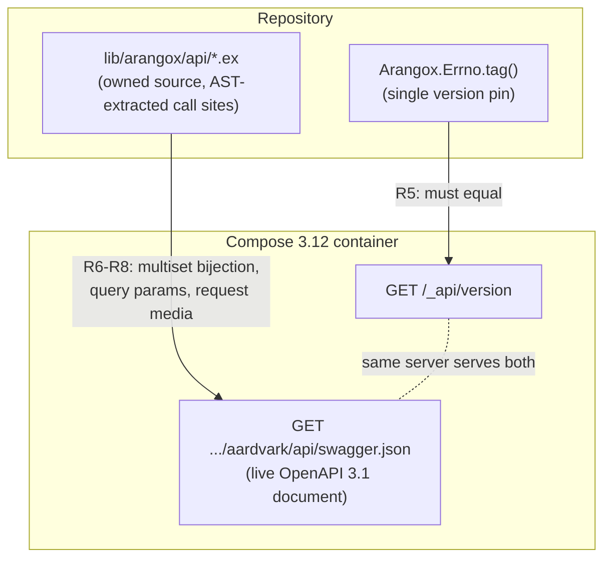

# Retire API Codegen - Plan

## Goal Capsule

- **Objective:** Retire code generation for the `Arangox.Api.*` surface. The 243 operations become owned, hand-maintained source; the generator machinery is deleted; conformance is proven against the live ArangoDB server's own OpenAPI document; `getDocuments` is reinstated as a hand-written operation that cannot send a destructive request. Lands inside the 0.8.0 release on `feat/v0-8-modernization`.
- **Authority:** This plan deliberately reverses two decisions of `docs/plans/2026-08-06-001-feat-arangox-1-0-modernization-plan.md` — R40 and KTD16 (vendored document, reproducible regeneration, CI regen-and-diff). It preserves that plan's R39 (coverage of the vendor's document, now live-verified) and R41 (one narrow adapter). Repo conventions in `AGENTS.md` govern style, comments, and test hygiene throughout.
- **Stop conditions:** Stop and surface if the operation files need behavioral edits beyond the two sanctioned ones (adding `get_documents`, rewording `client.ex` docs); if the new gate reveals drift between the owned surface and the live document beyond the known missing `getDocuments`; or if the live document stops serving the dimensions the gate reads.
- **Execution profile:** Code. Red-before-green for behavior-bearing changes; mutation probes for tests that pin already-shipped behavior (both per `AGENTS.md`).

---

## Product Contract

### Summary

Stop generating the API surface and start owning it. Delete `:oapi_generator`, `priv/openapi/` (preprocessing, renderer, vendored documents), the generator config, and the CI regeneration job. Replace the vendored-document bijection gate with an integration-tier conformance test against the document the running 3.12 container itself serves, checking addresses, query-parameter sets, and request media. Hand-write `get_documents/4` with `onlyget=true` forced. Rewrite every claim that the surface is generated.

### Problem Frame

The generator never made a transcription error; every real defect in the generated surface was a judgment failure the tool is structurally incapable of — fragments treated as addresses, a required parameter emitted optional turning a reader into a destroyer, non-JSON bodies mislabeled. The preprocessing script, custom renderer, waiver list, and never-hand-edit rule are machinery for retrofitting judgment onto a judgment-free tool, and each regeneration would re-import the whole class of unknown-unknowns for re-auditing. Meanwhile the corpus itself has survived a security review and two peer review rounds. The completeness guarantee never lived in the generator — it lives in the gate, which survives the generator's deletion and gets stronger. Session probes confirmed the running `arangodb:3.12.10` container serves an OpenAPI 3.1 document identical to the vendored one on every dimension the gate reads (164 paths, 243 operations, parameter sets, request media), so the oracle can be the tested server itself, collapsing two version pins into one.

### Requirements

**Ownership flip**

- R1. The files under `lib/arangox/api/` remain byte-identical through the flip except for two sanctioned edits: `documents.ex` gains `get_documents/4` (U1) and `client.ex` gets doc and message rewording (U5).
- R2. All generation machinery is removed: the `:oapi_generator` dependency and its lock entries (including transitive `yamerl` and `yaml_elixir`), `config/config.exs` (entirely generator config), `priv/openapi/` (preprocess, renderer, vendored documents, README), the CI job "Generated surface is reproducible", the two `renderer.ex` entries in `.dialyzer_ignore.exs`, the `linguist-generated` marking in `.gitattributes`, and the `priv/openapi` entry in `elixirc_paths(:dev)`.
- R3. After removal, `mix test`, `mix test.integration`, `mix dialyzer`, `mix compile --warnings-as-errors`, `mix format --check-formatted`, and `mix docs` all pass, and no file outside `docs/plans/` and `docs/handoffs/` references `priv/openapi`.

**Conformance gate**

- R4. An integration-tier test in the 3.12 tier (`integration: true`) fetches the server's OpenAPI document through the driver from `TestHelper.default()` and fails loudly when the fetch fails. No silent skip, no vacuous pass.
- R5. Before any comparison, the gate asserts the server's `/_api/version` equals `Errno.tag()`. This keeps the error-table, API-surface, and test-server tag agreement previously enforced by the `priv/openapi`-reading test in `test/arangox/errno_test.exs`, and makes a wrong-version container fail with a clear message instead of phantom drift. The gate never asserts on the document's `info.version` (its format differs from the server version string).
- R6. Method-and-path conformance is a multiset bijection between the document's operations and the surface's call sites, with URL-fragment stripping and the parameter-name normalization rule applied to the document side, and no waiver list.
- R7. Per operation, the query-parameter name set the code can send equals the document's declared query parameters. Extraction reads the `Keyword.take` literal; `get_documents`' unconditionally injected `onlyget` is the one documented exception, and any query-construction shape the extractor does not recognize fails the gate rather than passing unchecked.
- R7a. The gate also asserts the document's set of `{operation, required query parameter}` pairs equals a checked-in expectation, so a parameter becoming required, ceasing to be required, or appearing as required at a future pin forces a human decision instead of passing silently. The code side is not checked for enforcement — the surface deliberately accepts all query parameters as optional (`getDocuments` excepted); this assertion watches the document side for change.
- R8. Per operation, the declared request media in the code's `request:` metadata equals the document's request content types.
- R8a. Before any comparison, the gate asserts cardinality on both sides — the fetched document's path and operation counts and the extracted call-site count match the checked-in expectation (164 paths, 243 operations at the current pin) — so an extraction or parse regression cannot produce a vacuous pass of empty sets.
- R9. The pure-source checks keep running in the unit tier with no Docker: the adapter-seam denylist (every operation file declares `@default_client Arangox.Api.Client` and references no transport module), no URL fragments in operation URLs, no un-interpolated path parameters, and a call-site count assertion (exactly 243 `client.request/1` call sites) so an accidental deletion or duplication of an operation turns local `mix test` red instead of surfacing only in the integration leg.

**getDocuments**

- R10. `get_documents/4` exists in `lib/arangox/api/documents.ex`, mirroring the surface's shape: same `args:`/`url:`/`method:` form as its sibling `replace_documents/4`, `call: {Arangox.Api.Documents, :get_documents}`, document-matching `request:`/`response:` metadata, the uniform `@spec`, alphabetical placement.
- R11. No caller input can produce the request without `onlyget=true`. Passing `onlyget: false` (or any value) in `opts` still sends `onlyget=true`.
- R12. Behavioral integration coverage: documents created through the surface are read back through `get_documents/4` against the live server.

**Documentation truth**

- R13. Every claim that the surface is generated, regenerable, or CI-diffed is rewritten: `README.md`, the `CHANGELOG.md` 0.8.0 entry, `AGENTS.md` ("Generated code" section and the `:oapi_generator` warning quirk), `.gitattributes`, the `docker-compose.yml` header comment, the dangling `priv/openapi` path references in `lib/arangox/query.ex` and `lib/arangox/errno.ex`, and `lib/arangox/api/client.ex` moduledoc plus its three runtime error strings (with their test assertions).
- R14. Durable knowledge from `priv/openapi/README.md` survives relocation: the parameter-name normalization rule and its 12-name mapping, the fragment convention, the `getDocuments` waiver rationale, the three fidelity gaps (four `items`-less array schemas, the dropped header parameters including `x-arango-trx-id` and `If-Match`, the `_db/{database-name}` URL prefix), the caution that required query parameters are optional across the whole surface, and a rewritten update procedure for a new server tag. Each relocated fidelity gap carries the recipe that derived it (the concrete query against the live document that counts `items`-less array schemas or enumerates header parameters), and the update procedure re-runs those recipes at every server-tag bump so the disclosures cannot go stale silently once the vendored inputs are gone.

### Scope Boundaries

- **Deferred to Follow-Up Work:** none — the flip is self-contained.
- **Outside this work's identity:** the errno generator (`priv/arangodb/gen_errno.exs` and its SHA-pinned `.dat`) is a separate mechanism and stays; no operations are added beyond `getDocuments`; no response-schema validation; no new HTTP client dependency (the driver fetches its own oracle); the velocy dependency pin and release steps are separate work.

---

## Planning Contract

### Key Technical Decisions

- KTD1. **Freeze the corpus; delete the machinery.** The 243 operations are adopted as owned source exactly as generated; `:oapi_generator`, `preprocess.exs`, `renderer.ex`, and the vendored documents are deleted. (session-settled: user-directed — chosen over keeping the generator: every real defect was a judgment failure the generator cannot make, and regeneration re-imports unknown-unknowns; and over rewriting the operations fresh: the corpus already survived a security review and two peer rounds.)
- KTD2. **The oracle is the live server's own document.** The conformance gate fetches `/_db/_system/_admin/aardvark/api/swagger.json` from the compose 3.12 container through the driver itself. (session-settled: user-directed — chosen over the vendored-document oracle: one version pin instead of two, and "matches the tested server" is a stronger claim than "matches a blob downloaded once"; verified equivalent on every gate dimension against the running 3.12.10 container, twice.) Accepted consequence: the gate is integration-tier, so plain `mix test` without Docker no longer runs it; CI's 3.12 integration leg and `mix test.integration` do.
- KTD3. **Gate depth: addresses, query parameters, request media.** Multiset method/path bijection plus per-operation query-parameter sets plus declared request media, with a document-side required-parameter watch (R7a); no response-schema checking. (session-settled: user-approved — chosen over bijection-only, which would miss a renamed or dropped parameter, and over full schema conformance, which is heavy gate code against a quirky vendor spec for little marginal protection.) The extractor is deliberately narrow: it reads `Keyword.take` literals, carries `get_documents` as the one documented exception, and fails loudly on any construction shape it does not recognize — a general dataflow analysis would serve exactly one call site while adding AST-matching ambiguity.
- KTD4. **`get_documents` forces its flag in its own body.** The query is built `Keyword.take(opts, [:ignoreRevs]) |> Keyword.put(:onlyget, true)` — put after take, so a caller cannot override it back to a destructive replace. (session-settled: user-directed — chosen over an adapter special-case keyed to the operation: safety lives in the operation, the adapter stays operation-agnostic.)
- KTD5. **One version pin, stated by the errno module.** `Errno.tag()` becomes the repo's single statement of the pinned server tag; the gate asserts it equals the live `/_api/version` (R5). The `errno_test.exs` test that lists `priv/openapi/` to enforce tag agreement is retired in favor of this stronger, live assertion — it would otherwise crash when the directory is deleted.
- KTD6. **Pure-source checks stay unit-tier.** The adapter-seam, no-fragment, and no-un-interpolated-parameter checks read only the repo and move to a unit-tier file; only the document-comparing half becomes integration-tier. Splitting the current gate file, not moving it wholesale.
- KTD7. **Knowledge relocates to its enforcement points.** With `priv/openapi/README.md` deleted: the normalization rule and fragment convention are documented in the new gate (now their only copy — the current test comments call the rule "a mirror of the preprocessor's"; after deletion there is no original left to mirror); the waiver rationale moves onto `get_documents`'s `@doc`; the fidelity gaps and update procedure move to `AGENTS.md` and `README.md`.

### High-Level Technical Design

The gate closes a three-way agreement — one pin, checked live:

Document-side normalization (previously spread across `preprocess.exs` and the gate) lives wholly in the gate: strip `#fragment` from path keys (the document's convention for operations sharing an address — its own Swagger UI initializer documents this), and rename kebab/mixed-case path parameters to the snake_case the source uses (12 names, e.g. `{database-name}` → `{database_name}`). Call-site extraction reuses the existing AST prewalk (`client.request/1` maps) and template reconstruction, extended to read query keys and `request:` media per R7. After fragment stripping, **nine** addresses carry more than one operation (24 operations total — `POST` on the index path alone carries eight variants), so per-operation pairing is by group: both sides group by `{method, normalized template}`, and the gate compares the multiset of `{query key set, request media}` within each group, naming the address on failure. The `PUT` document path is the only group whose members differ in those sets; `onlyget` is what distinguishes them there.

### Sequencing

U1 lands while the old vendored-document gate still exists, so the outgoing gate's last act is proving the new function's *address* — the 243/243 multiset with its waiver removed; that gate reads nothing else, so the function's query and media choices wait for U2's checks. U2 adds the live gate alongside it. U3 restructures the test files and retires the old gate and the `errno_test.exs` directory-listing test. Only then does U4 delete the machinery — nothing that reads `priv/openapi` survives at that point. U5 makes the documentation true last, describing the end state.

---

## Implementation Units

### U1. Reinstate getDocuments as a hand-written operation

- **Goal:** `get_documents/4` exists and is safe by construction. Its *address* is proven by the outgoing gate before the machinery changes (243/243 multiset with the waiver removed); its query-key and request-media conformance is first proven when U2's gate lands.
- **Requirements:** R10, R11, R12, R1.
- **Dependencies:** none.
- **Files:** `lib/arangox/api/documents.ex`, `test/arangox/api/generated_test.exs` (waiver removal), `test/arangox/api/client_test.exs` (override test), `test/arangox/api/generated_integration_test.exs` (behavioral test).
- **Approach:**
  1. Write `get_documents(database_name, collection, body, opts \\ [])` mirroring `replace_documents/4` at `lib/arangox/api/documents.ex:846`: same `args:` and `url:` interpolation shape (the gate reconstructs identity from the URL AST — a literal-embedded query string would break it), `method: :put`, `request: [{"application/json", [:unknown]}]` (the body is one of the four `items`-less array schemas; `delete_documents` shows the form), `response: [{200, :null}, {400, :null}, {404, :null}, {410, :null}]`, uniform `@spec`, placed alphabetically.
  2. Query per KTD4: `Keyword.take(opts, [:ignoreRevs]) |> Keyword.put(:onlyget, true)`. The `@doc` carries the waiver rationale: same path and method as `replaceDocuments`, distinguished only by this flag; omitting it would replace — destroy — the documents it was asked to read.
  3. Remove the `@waivers` entry from `test/arangox/api/generated_test.exs` in the same commit; the old gate's multiset comparison then expects and finds both operations on the shared address.
- **Execution note:** Red first — removing the waiver before adding the function shows the old gate failing on the missing operation, then the function turns it green.
- **Test scenarios:**
  - The old gate passes with the waiver removed and the function added (243/243, no waivers).
  - Unit (protocol tier, recorded server): calling `get_documents` sends `onlyget=true` in the query string.
  - Unit: calling with `onlyget: false` in opts still sends `onlyget=true` — the failure path that never falls out of happy-path coverage.
  - Unit: `ignoreRevs` passes through when given.
  - Integration: create two documents via the surface, read both back through `get_documents/4` by key list, assert bodies match and the documents still exist afterward (a replace would have destroyed them).
- **Verification:** `mix test` green including the modified gate; `mix test.integration` green.

### U2. The live-oracle conformance gate

- **Goal:** An integration-tier test proves the owned surface conforms to the document the tested server itself serves.
- **Requirements:** R4, R5, R6, R7, R8.
- **Dependencies:** U1 (the gate expects 243/243 with no waivers).
- **Files:** `test/arangox/api/conformance_test.exs` (new), reusing extraction machinery from `test/arangox/api/generated_test.exs`.
- **Approach:**
  1. `@moduletag :integration` (3.12 tier). `setup_all` starts a pool via `TestHelper.opts(endpoints: TestHelper.default())` (the pattern in `generated_integration_test.exs`), fetches `/_db/_system/_admin/aardvark/api/swagger.json` with an explicit raised `timeout:` (the body is ~1 MB), and asserts a 200 with a decoded map — any failure is a test failure, not a skip (R4).
  2. Assert `Errno.tag()` equals the live `/_api/version` `"version"` field, with a failure message naming both and pointing at `ARANGO_VERSION`/compose (R5, KTD5).
  3. Port `strip_fragment/1`, `normalize_template/1`/`normalize_param/1`, the multiset `missing_operations/3`, and the AST `call_sites/1`/`template/1` from the old gate. The moduledoc now owns the normalization rule's full statement and the fragment convention (KTD7).
  4. Extract query keys per R7: the `Keyword.take` literal, with `get_documents`' injected `onlyget` as the one documented exception, failing the gate on any unrecognized construction shape. Compare per group as the High-Level Technical Design specifies: group both sides by `{method, normalized template}` and compare the multiset of `{query key set, request media}` within each group (nine groups are multi-operation today); assert the document's required-parameter pairs against the checked-in expectation (R7a).
  5. Assert cardinality before comparing (R8a): document path and operation counts and extracted call-site count match the pin's expectation, so empty-set extraction can never pass. Keep the old gate's self-test pattern: the multiset comparator and the query extractor get their own in-file self-tests so a broken comparator cannot pass vacuously.
- **Execution note:** Behavior-pinning tests need mutation probes per `AGENTS.md`: break production code deliberately (rename a `Keyword.take` key, change a `request:` media type, alter one URL segment), confirm the gate fails for the right reason each time, restore from a hash-checked backup.
- **Test scenarios:**
  - Green run against the running 3.12.10 stack: 243/243 addresses, all parameter sets, all media conform — including `get_documents`, named explicitly, whose query and media conformance is first proven here.
  - Cardinality self-check: an extractor deliberately fed an empty module list fails the R8a assertion rather than reporting conformance.
  - Required-parameter watch: altering the checked-in expectation by one pair fails the R7a assertion naming the operation.
  - Mutation probe: a renamed query key in one operation fails the R7 check naming the operation.
  - Mutation probe: a changed media type fails the R8 check.
  - Mutation probe: an altered URL segment fails the bijection in both directions (multiset self-test already covers comparator correctness).
  - Version mismatch: with the gate pointed at the 3.11 trio's port (temporarily, as a probe), the R5 assert fails before any comparison noise.
- **Verification:** `mix test.integration` green; probes recorded in the commit message per repo convention.

### U3. Split the test files; retire the vendored-document readers

- **Goal:** Unit-tier keeps every check that needs no Docker; nothing left in the tree reads `priv/openapi`.
- **Requirements:** R9, and unblocks R2/R3.
- **Dependencies:** U2 (the live gate must exist before the old one is deleted).
- **Files:** `test/arangox/api/surface_test.exs` (new, unit tier), `test/arangox/api/generated_test.exs` (deleted), `test/arangox/errno_test.exs`.
- **Approach:**
  1. Move the three pure-source checks into `surface_test.exs`: adapter-seam denylist (`@default_client Arangox.Api.Client` present; `Arangox.Client`, `MintClient`, `VelocyClient`, `DBConnection`, `Mint.`, `:gen_tcp`, `:ssl.`, `Arangox.Connection` absent), no URL fragments, no un-interpolated path parameters. Add the R9 call-site count assertion (exactly 243 `client.request/1` call sites, reusing the AST extraction) as the Docker-free tripwire on the frozen corpus. These become more important, not less, once the files are hand-maintained.
  2. Delete `generated_test.exs` — its document-comparing half is superseded by U2, its source-checking half now lives in `surface_test.exs`.
  3. In `errno_test.exs`, delete the test that lists `priv/openapi/` (it would crash on the deleted directory); its invariant now lives in the U2 gate's R5 assert. Update the surrounding prose that names `priv/openapi`.
- **Execution note:** Mutation-probe the moved checks once in their new home (e.g. a transport reference smuggled into an operation file fails the seam test) — a moved test that can no longer fail is a deleted test.
- **Test scenarios:**
  - `mix test` green with `generated_test.exs` gone.
  - Probe: a `Mint.` reference in an operation file fails the seam check.
  - Probe: a `#fragment` in a URL fails the fragment check.
- **Verification:** `mix test` green with no Docker; `git grep priv/openapi test/` returns nothing.

### U4. Delete the generation machinery

- **Goal:** The generator, its inputs, its config, and its CI job are gone; every build and analysis command still passes.
- **Requirements:** R2, R3, R1 (no `lib/arangox/api/` changes in this unit).
- **Dependencies:** U3.
- **Files:** `mix.exs`, `mix.lock`, `config/config.exs` (deleted), `.dialyzer_ignore.exs`, `.gitattributes`, `.gitignore`, `.github/workflows/elixir.yml`, `priv/openapi/` (deleted).
- **Approach:**
  1. `mix.exs`: drop the `:oapi_generator` dep (line 117); collapse `elixirc_paths(:dev)` into the default clause with its comment; reword the `package.files` comment and the Hex `@description`'s "generated resource APIs" phrasing.
  2. `mix deps.unlock --unused && mix deps.get` — `mix deps.get` alone does not remove entries whose dependency has left the tree, so the unlock step is what actually drops `oapi_generator`, `yamerl`, and `yaml_elixir` from `mix.lock`.
  3. Delete `config/config.exs` outright (it is entirely the generator block, and its absence is what removes the `:oapi_generator` startup warning documented in `AGENTS.md`).
  4. Delete both `renderer.ex` entries and their comment from `.dialyzer_ignore.exs` in this same commit — `list_unused_filters: true` turns a stale entry into a dialyzer failure.
  5. Remove the `linguist-generated` block from `.gitattributes` (owned source should count in language stats and render in diffs) and the `api-docs-*.generated.json` ignore from `.gitignore`.
  6. Delete the CI `generated-surface` job (`.github/workflows/elixir.yml:109-138`). The new gate needs no new job — it rides the existing `integration-3-12` leg's `--only integration:true`.
  7. `rm -r priv/openapi/`.
- **Execution note:** Characterization discipline — record the U3 completion commit and audit this unit as `git diff <u3-commit>..HEAD --stat -- lib/`, which must be empty. A plain working-tree diff cannot isolate this unit once U1's sanctioned `documents.ex` change is on the branch. The freeze is the point; any `lib/` change in this unit is a defect.
- **Test scenarios:** `Test expectation: none beyond R3's command gauntlet` — this unit is deletion; the proof is that every existing tier and analysis command still passes with the machinery gone.
- **Verification:** `mix deps.unlock --unused && mix deps.get && mix compile --warnings-as-errors && mix test && mix dialyzer && mix format --check-formatted && mix docs` all green; `mix test.integration` green; `oapi_generator`, `yamerl`, and `yaml_elixir` absent from `mix.lock`; `git grep -l "priv/openapi" -- . ':!docs/plans' ':!docs/handoffs'` returns nothing.

### U5. Documentation truth pass

- **Goal:** Every document and docstring describes the owned surface; the knowledge worth keeping has a durable home.
- **Requirements:** R13, R14, R1 (the `client.ex` edit is doc/message wording only).
- **Dependencies:** U4.
- **Files:** `README.md`, `CHANGELOG.md`, `AGENTS.md`, `docker-compose.yml` (header comment), `lib/arangox/query.ex`, `priv/arangodb/gen_errno.exs`, `priv/arangodb/README.md`, `lib/arangox/errno.ex` (regenerated, never hand-edited), `lib/arangox/api/client.ex`, `test/arangox/api/client_test.exs`, `test/arangox/api/generated_integration_test.exs` (renamed).
- **Approach:**
  1. `README.md`: rewrite the "generated, not hand-written" passage — the surface is spec-derived owned source, verified against the tested server's own OpenAPI document by the integration tier; keep the fidelity-gap disclosures (header parameters not exposed, per R14) in user-facing terms; "243 operations" becomes accurate with `getDocuments` present.
  2. `CHANGELOG.md` 0.8.0: rewrite "generated resource API… CI regenerates and fails on any diff" to the owned-surface + live-conformance story, and note `getDocuments`' availability with its forced flag.
  3. `AGENTS.md`: replace the "Generated code" section (keeping the errno half) with an "API surface" section — owned source under `lib/arangox/api/`, the conformance gate and its tier, the update procedure for a new server tag (bump compose/`ARANGO_VERSION` and the errno pin, run the gate, hand-apply the diff it reports, consult the server changelog); delete the `:oapi_generator` warning quirk; fix the image-repository quirk's "OpenAPI pin" wording.
  4. `docker-compose.yml` header: the pinned tag is now what the conformance gate verifies the surface against — the wording strengthens.
  5. Fix dangling `priv/openapi/...` references: `lib/arangox/query.ex:38` directly; for `lib/arangox/errno.ex:12`, edit the generator template in `priv/arangodb/gen_errno.exs` (lines 36 and 134 reference `priv/openapi`) and re-run `mix run priv/arangodb/gen_errno.exs` — the module is generated output the repo forbids hand-editing. Update `priv/arangodb/README.md` (lines 25, 70, 75) the same way.
  6. `lib/arangox/api/client.ex`: reword moduledoc ("generated" → the owned surface; "the header parameters the generator drops" → "the header parameters the surface does not expose") and the three runtime error strings, updating the `client_test.exs` assertions that match them in the same commit.
  7. Rename `test/arangox/api/generated_integration_test.exs` to `surface_integration_test.exs` and rewrite its moduledoc, which cites the retired coverage gate.
- **Test scenarios:**
  - `mix test` and README doctests (`--only integration:readme`) green after wording changes.
  - `git grep -in "generat\|vendored" -- lib test README.md CHANGELOG.md AGENTS.md` — every remaining hit read and classifiable as the errno generator, historical prose, or an accurate description of the owned surface; no hit claims the API surface is generated, regenerable, vendored, or CI-diffed.
- **Verification:** full gauntlet green (R3 command list plus `mix test.integration`); `mix docs` renders without warnings.

---

## Verification Contract

| Gate | Command | Proves |
|---|---|---|
| Unit/protocol tier | `mix test` | Surface source checks (R9), `get_documents` unit behavior (R11), no Docker required |
| Integration tier | `docker compose up --detach --wait && mix test.integration` | Conformance gate (R4–R8), `get_documents` behavior (R12), README doctests |
| Analysis | `mix dialyzer` | No stale ignore entries (`list_unused_filters: true` enforces) |
| Build hygiene | `mix compile --warnings-as-errors && mix format --check-formatted && mix docs` | Machinery removal left nothing dangling |
| Reference sweep | `git grep -l "priv/openapi" -- . ':!docs/plans' ':!docs/handoffs'` | Empty (R3) |
| Claim sweep | `git grep -in "generat\|vendored" -- lib test README.md CHANGELOG.md AGENTS.md` | Every hit reads as errno generator, history, or accurate owned-surface prose (R13) |
| Freeze audit | `git diff <flip-base>..HEAD --stat -- lib/arangox/api/` from the branch point of this work | Only `documents.ex` and `client.ex` changed, matching R1's two sanctioned edits; U4 additionally shows an empty `lib/` diff against the recorded U3 completion commit |

Behavior-bearing changes carry red-before-green evidence; tests pinning shipped behavior carry mutation probes, recorded in commit messages (repo convention).

---

## Definition of Done

- All requirements R1–R14 hold; every unit's verification ran green, including both test tiers on the full compose stack.
- The freeze audit shows the operation corpus untouched except the two sanctioned edits.
- The conformance gate has demonstrated at least one genuine red per checked dimension (mutation probes) and a green run against `arangodb:3.12.10`.
- No dead machinery remains: dependency, lock entries, config file, CI job, dialyzer filters, git attributes, ignore entries.
- Documentation reads true for a cold reader: nothing claims generation, regeneration, or a vendored document; relocated knowledge (R14) is findable from `AGENTS.md` or the gate itself.
- No experimental or dead-end code from the flip remains in the diff.

---

## Sources & Research

- Live-oracle verification (twice, this session): `GET /_db/_system/_admin/aardvark/api/swagger.json` on the running `arangodb:3.12.10` container is OpenAPI 3.1, 164 paths / 243 operations, identical to `priv/openapi/api-docs-3.12.10.json` on addresses, operationIds, query-parameter sets (names and required flags), path parameters, and request media. Sole differences: one float-precision artifact in a schema default, and the `info.version` string format — hence R5 asserts `/_api/version`, never `info.version`.
- Current gate mechanics to port: `test/arangox/api/generated_test.exs` — `strip_fragment/1`, `normalize_template/1`/`normalize_param/1` (the 12-name rename rule; after `preprocess.exs` is deleted this is the only copy), multiset `missing_operations/3` with self-tests, AST `call_sites/1`/`template/1`.
- `getDocuments` spec (identical live and vendored): path key `/_db/{database-name}/_api/document/{collection}#get`, `put`, query `onlyget` (required, boolean) and `ignoreRevs` (optional, string); shape template at `lib/arangox/api/documents.ex:846` (`replace_documents/4`), `:unknown` body form at `delete_documents`.
- Hard dependency found by research: `test/arangox/errno_test.exs:48` lists `priv/openapi/` with `File.ls!` — crashes on deletion; KTD5/U3 own the fix.
- Deletion inventory: `mix.exs:117` (dep), `:73` (elixirc_paths), `:53-58` (dialyzer `list_unused_filters: true`); `config/config.exs` (whole file); `.github/workflows/elixir.yml:109-138` (regen job); `.dialyzer_ignore.exs:7-13`; `.gitattributes:1-6`; `.gitignore:27-29`.
- Stale-claim inventory for U5: `README.md:301,314-323`; `CHANGELOG.md:53-59,101`; `AGENTS.md:80-90,106-108,113-115`; `docker-compose.yml:1-5`; `lib/arangox/query.ex:38-39,72`; `lib/arangox/errno.ex:12`; `lib/arangox/api/client.ex` moduledoc and runtime strings.
- Institutional learnings applied: `docs/solutions/architecture-patterns/transport-tls-defaults-are-not-the-drivers-to-supply.md` (deletion pattern and test-pruning corollary — the seam test outlives the generator); `docs/solutions/logic-errors/trx-id-popped-before-commit-ack-orphans-server-transaction.md` (characterize-first freeze discipline; the override failure path needs its own test).
- Reversal anchors in `docs/plans/2026-08-06-001-feat-arangox-1-0-modernization-plan.md`: overturns R40 and KTD16; preserves R39 and R41; related KD12, U19–U21 unaffected in substance.
